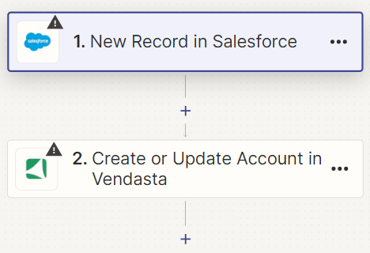
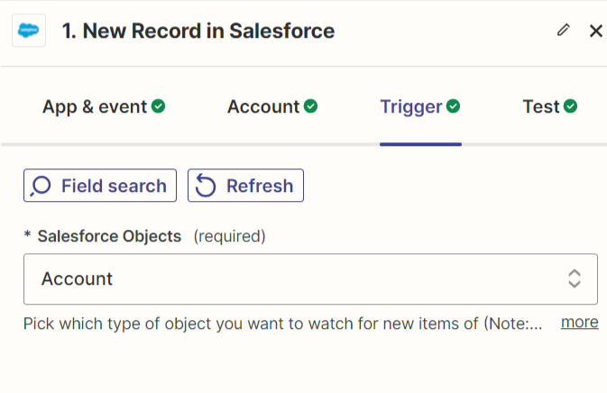

# Overview
This document outlines the process for sycing new accounts from Salesforce to Vendasta utilizing Zapier. It could also be adapted for update operations, as Vendasta's Account Create action is an *Upsert* operation.

---

## Prerequisites
* Ensure you have active accounts/subscriptions with **Vendasta**, **Zapier**, and **Salesforce** (a paid Zapier subscription is required).
* Your technical team must be able to maintain the Zapier connection between Salesforce and Vendasta.
* Your Vendasta subscription must provide access to the Zapier connection portal. You can find this by navigating to **Administration > Integrations > Zapier > Connect on Zapier**.

---

## Workflow:

### Zap Creation & Setup
1. Access **Zapier.com**.
2. To give yourself a head start, utilize the AI Zap creator. Enter the prompt: *"Salesforce account create to account create in Vendasta. Update Salesforce account custom field with Vendasta account ID from new account".*
3. Zapier will automatically create a Zap for you: e.g. "Sync Salesforce Accounts to Vendasta Accounts".

- Click **Try It**.

### Step 1 - Zap Trigger
#### Configurations with Salesforce to Consider
* For **Step 1**: The App must be **Salesforce**, and the Event must be **New Record**.

* Connect your authenticated Salesforce account from your organization.

* Search and select **Account** as the Salesforce Object to trigger on.

* Select a record "Account" to test with if desired.

---

### Step 2 - Vendasta Account Create
* To continue setup with Vendasta, the Event must be configured as **Create or Update Account**.

* Connect your Vendasta account.

* Enter your three or four alphanumeric **Partner Identifier (PID)**. This is always visible in the top left of Partner Center.

* Further, under **Action > Basics**, enter the **Business Name** – this is the only required field when creating a new account. Add additional fields as desired; full NAP (Name, Address, Phone) data is recommended.

---

### Step 3 - Sync back Vendasta AccountID to Salesforce
* Add a third step in your Zap using the **Salesforce App**, with the event being **Update Record**.

* Your authenticated Salesforce account should already be connected from Step 2 above.
* Adding an **External ID custom field** to your Salesforce Account Object is necessary before the next step.
    * **Note**: You will need to refresh your Zap to see the new field become available if you are editing the Zap while adding the field to Salesforce.
* Under **Action** "Update Record", the Salesforce object must be **Account**, and the Record to Update will be **Salesforce ID**.
* In the UI of this step, scroll down and find your newly configured "**external_id**" field. Map the **Vendasta Standard account Id** from Step 2 to the External ID field to store a mapping of Vendasta’s Account ID to your Salesforce Account. (The instructions to add this field to your Salesforce Account object are found in point 3 above).

---

### Zap Testing & Publishing
* Test your Zap at your discretion, then **Publish**. The publishing step will also toggle on the Zap.

* Your completed and published Zap:

