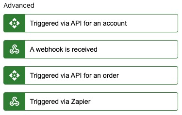

# Trigger a prebuilt automation

Automations are a powerful tool within the Vendasta platform, they can be used to set up unique workflows and create efficienciencies. 

If you have setup automations in the Vendasta platform you can trigger them for a business. This enables you to set up a complex chain of actions from a single request. 

[Learn more about automations](https://support.vendasta.com/hc/en-us/categories/24285550627223-Automations)

There are **two options** for triggering an Automation depending on the level of security needed based on the operations contained in the target Automation.

1) Webhook Trigger - Use for non sensitive Automations. *You can still add an expected key(which could be rotated) as a filter when editing the trigger if desired*
2) API Trigger - Use for Automations that contain sensitive operations, or that can affect billing such as product activations

These options are found under the *Advanced* section within the Automations trigger list:


<!-- theme: warning -->
> The API trigger is only available for Partner automations. The Webhook trigger is available for both Partner and Business App automations.

# Webhook Trigger - Setup


# API Trigger - Setup

Create an access token with at least `business` scopes following the [Authorization guide](../../Authorization/Authorization.md).

Create an automation in the Vendasta platform with the "It's triggered via API" [trigger](https://support.vendasta.com/hc/en-us/articles/4406952880919-Automation-triggers).

If you would like to pass custom data to this automation, you will need to configure the return values to be the keys of the data payload that you are passing in the request body. This can be done by adding the keys of your data dictionary to the return values in the side panel of the trigger. By selecting the correct data types when configuring these return values, the automation will be able to automatically use this data for requirements of subsequent steps.

## Trigger the automation

<!--
type: tab
title: Request
-->

You will need the ID of the automation you previously created as well as the [business ID](../Accounts.md) of the business location you would like to trigger that automation for. Add the access token to the headers and send it off. 

This api call has an empty response.


```json http
{
  "method": "POST",
  "url": "https://prod.apigateway.co/platform/automationRuns",
  "query": {},
  "headers": {
    "Authorization": "Bearer <Token with 'business' scope>",
    "Content-Type": "application/vnd.api+json"
  },
  "body": {
     "data": {
        "type": "automationRuns",
        "relationships": {
            "businessLocation": {
                "data": {
                    "id": "AG-6TRBKMP2BQ",
                    "type": "businessLocations"
                }
            },
            "automation": {
                "data": {
                    "id": "Automation-254551a2-ab4c-41fa-b7c2-1c53d448e258",
                    "type": "automations"
                }
            }
        }
    }
  }
}

```
For more details on this endpoint see [Create Automation Runs](b3A6MjA0OTU3MTQ-create-automation-run).


<!--
type: tab-end
-->
