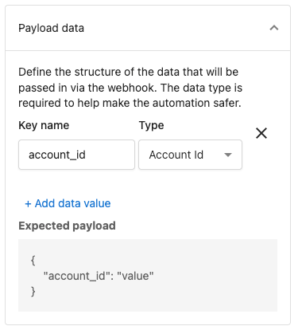

# Trigger a prebuilt automation

Automations are a powerful tool within the Vendasta platform. They can be used to set up unique workflows and create efficiencies.

If you have Automations configured in the Vendasta platform, you can trigger them in a variety of ways. This enables you to set up a complex chain of actions from a single request. 
>You can trigger Automations built in **Partner Center**, or on behalf of your clients in their **Business App.** The triggers are configured in the same manner for both systems.
>
>* [Learn more about automations](https://docs.vendasta.com/automations/automations-my-automations/getting-started-with-automations)
>* [Create a new automation](https://docs.vendasta.com/automations/my-automations/create-new-automation)
>* [Automation Templates in Business App](https://docs.vendasta.com/business-app/automations/automation-templates-in-business-app)

**Automation external triggers**

There are **three primary types** of external triggers for an Automation: ***Webhook***, ***API***, and ***Zapier***. The choice depends primarily on the level of security required for the operations involved, and also on the technologies the partner is already using and familiar with.

1) ***Webhook Trigger:*** No Authentication option; best for non-sensitive Automations.
2) ***Zapier Trigger:*** Used for easy, no-code integrations with thousands of external services.
3) ***API Triggers:*** Requires authentication; use for Automations that contain sensitive operations or that affect billing (e.g., product activations).


The first two options are found under the *Advanced* section within the Automations trigger list:

* [Webhook Trigger (Advanced)](#webhook-trigger)
* [Zapier Trigger (Advanced)](https://docs.vendasta.com/business-app/automations/trigger-automation-using-zapier)


*API Triggers (Object-Specific):*
* Triggered via API for an order (Advanced section)
* Triggered via API for an account (Advanced section)
* Triggered manually for a company (Manual section)
* Triggered manually for a contact (Manual section)

>API Triggers are **object specific**. In the rare case you need to trigger an ad-hoc Automation that does not involve one of these core objects, the Webhook or Zapier triggers should be used.

# Webhook Trigger
The **webhook trigger** accepts a JSON payload consisting of top-level key-value pairs. One of these values may be an object ID, which will unlock [Automation Actions](https://docs.vendasta.com/automations/my-automations/available-automation-steps) related to that object(including [custom objects](https://docs.vendasta.com/administration/data-management/crm-objects)). 

For example, if a payload value of type Account ID is provided, it will enable actions like 'Add an Account to a list'.


See *Data Passing* ([Why is the step I want to use greyed out?](https://docs.vendasta.com/automations/my-automations/automations-data-passing#:~:text=Why%20is%20the%20step%20I%20want%20to%20use%20greyed%20out%3F)) for more information.


# API Triggers

**Authentication** 

Create an access token with at least the `business` scope following the [Authorization guide](../../Authorization/Authorization.md).

**Setup** 

Create an automation in Partner Center, or Business App with one of the API Triggers listed above.

**Trigger Data Passing**
<!-- theme: warning -->
>Data passing into the Automation is only available for the ***Advanced*** **API Triggers** associated with `Account` and `Order` objects.

In the [Create Automation Run request](platform.yaml/paths/~1automationRuns/post) this data must be provided within the `data.attributes.data` JSON object.

When designing an Automation to be called via API, the expected data structure **must be preconfigured** on the Automation Trigger with keys matching those in the API request. By selecting the correct data types during configuration, the Automation can automatically use this data as input for subsequent steps.

>If needing to pass data for other objects, the Webhook Trigger should be used **OR** you can leverage **Object Reference Actions** (such as 'Get the associated company' or 'Find contact') to pull in the necessary object data within the Automation flow.

**Request**

The API triggers utilize the [Create Automation Run](platform.yaml/paths/~1automationRuns/post) endpoint.

To trigger an automation run two data points are **required**. The ID of the Automation (found in the URL as `Automation-***`) and the object ID, which is provided as `attributes.entityId` as follows:

```json
{
  "data": {
    "type": "automationRuns",
    "relationships": {
      "automation": {
        "data": {
          "type": "automations",
          "id": "Automation-91cb048c-c498-43ba-ab99-2ca2d27d2c46"
        }
      }
    },
    "attributes": {
      "entityId": "string",
      "data": {
        "optional_key": "optional_value"
      }
    }
  }
}