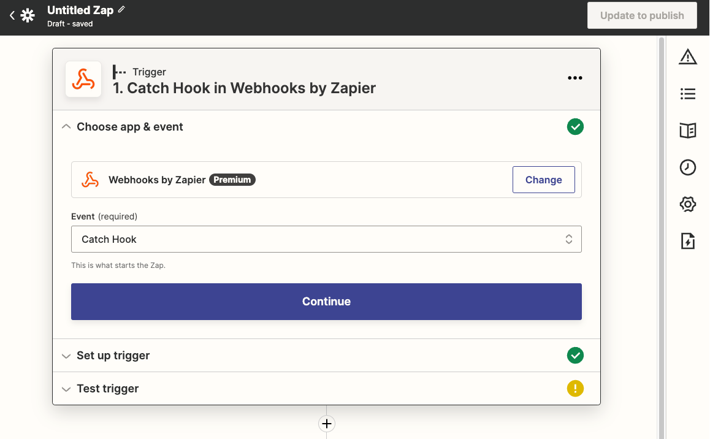
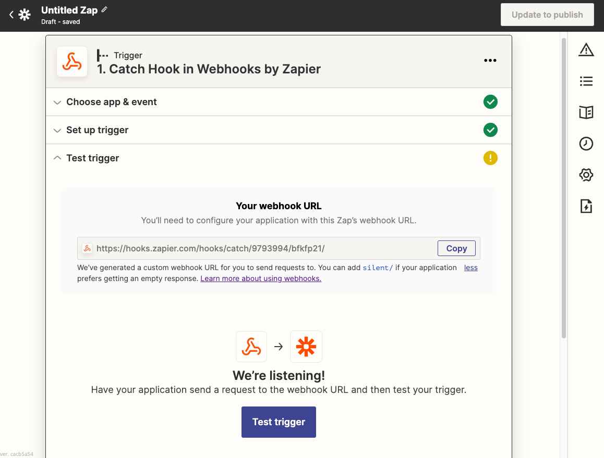
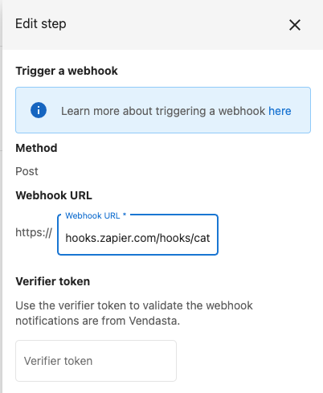
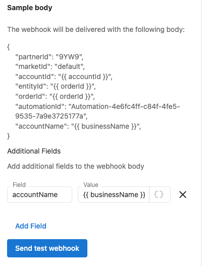
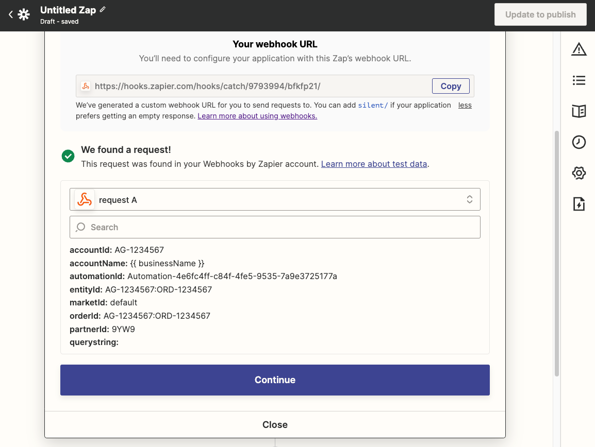
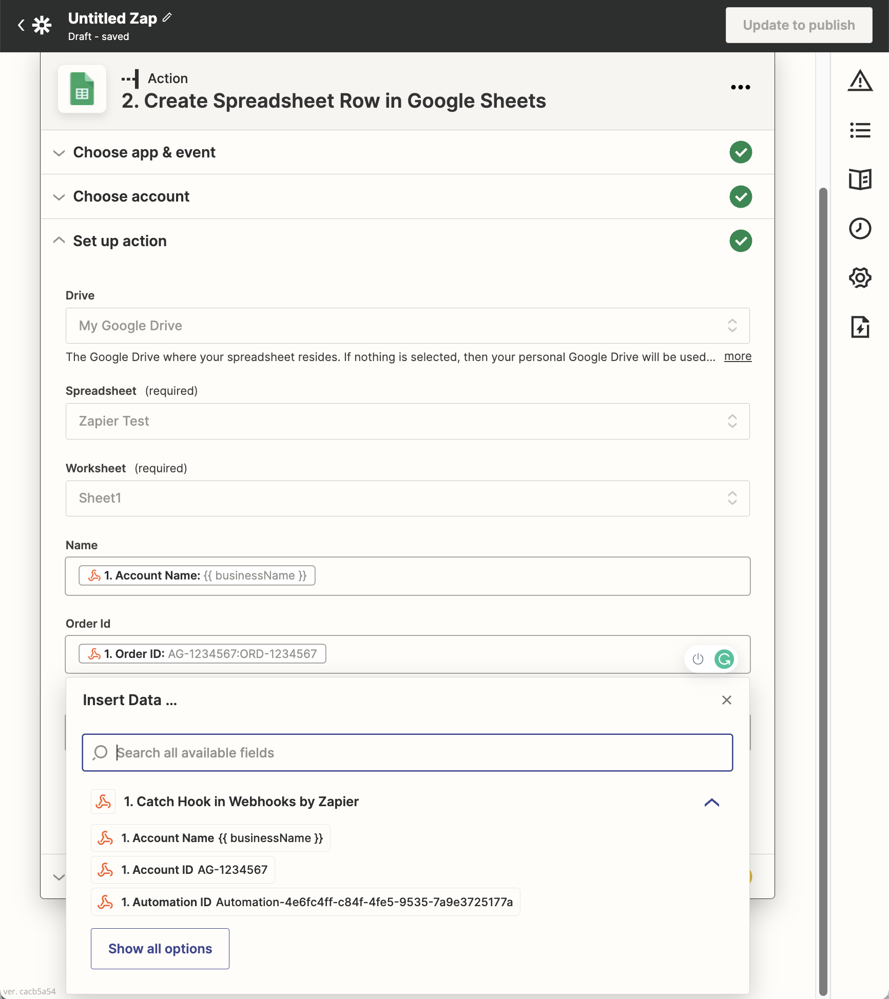

# Trigger Zapier Zap using an Automations

Vendasta Automations are a powerful tool for building custom processes within the Vendasta platform. To take action in 3rd party systems you will need to integrate with them directly or use a tool like [Zapier](https://zapier.com).

## Overview

This guide will show you how to set up a Vendasta Automation that causes Zapier to run a "zap" that updates data in another system.

## Prerequisites
1. You will need a paid Zapier account to follow this guide.
2. This guide assumes you are familiar with creating automations within the platform. If you are not familiar you should [learn more about automations](https://support.vendasta.com/hc/en-us/sections/4406950706583-Automations) first.

## Step 1: Create a Zap

Zapier calls their workflows "zaps". You will start by logging into your Zapier account and creating a new zap. You will want the "Webhooks by Zapier" app with the "Catch Hook" event.

Expand the "Test trigger" section and copy your webhook URL.

## Step 2: Add to Automation

In a new tab, go to the Vendasta Partner Center and create an Automation workflow based on the triggers and filters that are unique to your business process.

Add a "Trigger a webhook" step at the point you would like to call the 3rd party system. Paste the URL that you copied from Zapier in step one. The verifier token can be left blank as Zapier uses hard-to-guess URLs and HTTPS. 

Configure the webhook body to contain any of the fields that you want to send to the 3rd party. 

## Step 3: Test

Click the "Send test webhook" button in Vendasta. Then go back to Zapier editor and click "Test trigger". Zapier should display your test request.

## Step 4: Connect to 3rd party app

When you click "Continue" Zapier will ask you what app you would like to take action in. Follow their wizard. You will be able to use any of the fields from the webhook body as inputs to the form.

Here is an example of creating a new row in a Google spreadsheet

## Step 5: Turn on automation

Don't forget to turn on processing in Zapier by "publishing zap" and in Vendasta by saving and turning on your automation.

## Celebrate your success

Go get yourself a cookie to celebrate and tell us about your integration in the [Conquer Local Community](https://academy.conquerlocal.com/community/). 

