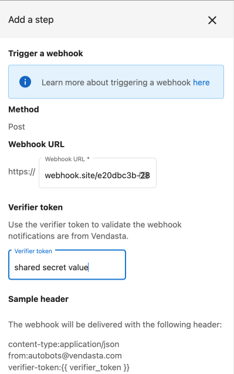
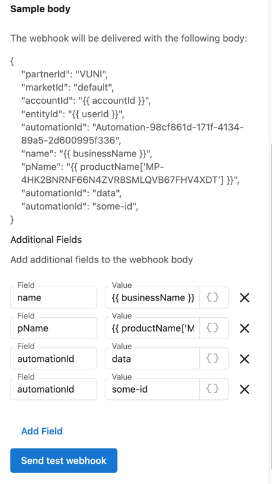

# Use the trigger a webhook action

You can take action in your systems based on events in the Vendasta platform by using automations. With any automation you can add the `Trigger a webhook` step to be notified when something happens. 

## Overview

In this guide we will create an automation, listen for the event and retrieve details of the affected records.

## Pre requsits

This guide assumes you are familiar with creating automations within the platform. If you are not familiar you should [learn more about automations](https://support.vendasta.com/hc/en-us/sections/4406950706583-Automations) first.


## Step 1: Automation setup

In Partner Center go to the automations screen and create an automation based on the trigger and criteria that you are interested in.

Add the `Trigger a webhook` step.



The **webhook URL** will be an endpoint that you have built in step 2. It will likely be one of your web servers but could also be a 3rd party system like Zapier. 

For testing purposes [webhook.site](https://webhook.site/) is a great tool for viewing what is sent. You may also use a tool like [ngrok](https://ngrok.com/) to route requests to your local development computer.

The **Verifier Token** is something that you can makeup. We will send it along with the webhook to help you verify that the request actually came from us.

> Coming soon is the ability to add additional fields to the request body. Be careful when including sensitive data. The requests are sent using https however we do not have a way to confirm the destination is under your team's control. Instead it is recommended to only send ids and then fetch up to date info using an API request. 



## Step 2: Setup your handler

On a webserver that you control you will want to setup an HTTP request handler that accepts POST requests.

### Step 2.1: Verify the request

The first thing that your handler function should do is check the value of the `Verifier-Token` request header. It should match what you specified in the automation configuration. If it does not you should assume someone random on the internet sent you the request and it should be thrown out. 

### Step 2.2: Parse the body

Next you can parse the request body as a JSON object.

**Example Body**
```json
{
  "accountId": "AG-1234567",
  "automationId": "Automation-7a416085-5668-467c-98ad-f903ad1c4187",
  "entityId": "AG-1234567:ORD-1234567",
  "marketId": "default",
  "orderId": "AG-1234567:ORD-1234567",
  "partnerId": "9YW9"
}
```


### Step 2.3: Do something

What you do here will depend on your goal. Most likely you will want to fetch up to date info for the affected record. See the below guide.

### Step 2.4: Return a response

Let us know that you received the request by responding with an appropriate HTTP status code. 


| code  | result  |
|-------|---------|
| 2xx | Success don't retry |
| 4XX | An error occurred do not retry as it will never be successful |
| 5XX | A transient error occurred, retry  |


The webhook may be resent automatically for a few reasons:
- You took more than 60 seconds to respond to the request
- The HTTP response code was >= 500
- The connection was broken before we processed the response

If you require more than 60 seconds to process the webhook you should start a background workflow to do the processing. (We are fans of the [Temporal](https://www.temporal.io/) workflow engine.)


## Optional: Fetch up to date info

Using the resource ids found in the request body you can fetch up to date info. Here are a few examples.

The first step for all of them is to [create an access token](../../Authorization/CallingAPIs.md) with the needed scope(s).

### Order

The [get order operation](../../../openapi/platform/platform.yaml/paths/~1orders~1{id}/get) can be used with the value from the `orderId` field.

<!--
type: tab
title: Example Request
-->

```json http
{
  "method": "get",
  "url": "https://prod.apigateway.co/platform/orders/{orderId}",
  "headers": {
    "Authorization": "Bearer <Token with `order` scope>"
  }
}
```

<!--
type: tab
title: Response
-->
```json
{
  "data": {
    "type": "orders",
    "id": "AG-7PQTGLLXQQ:ORD-S548DKHMKX",
    "attributes": {
      "lineItems": [
        {
          "sku": "MP-fba21121b71148c9bb33e11fcd92d520",
          "quantity": 1,
          "amount": 5300,
          "intervalCode": "monthly",
          "isPackage": false,
          "containedInPackage": ""
        }
      ],
      "currencyCode": "AUD",
      "statusCode": "draft"
    },
    "relationships": {
      "businessLocation": {
        "links": {
          "related": "https://demo.apigateway.co/platform/orders/AG-7PQTGLLXQQ:ORD-S548DKHMKX/businessLocation",
          "self": "https://demo.apigateway.co/platform/orders/AG-7PQTGLLXQQ:ORD-S548DKHMKX/relationships/businessLocation"
        },
        "data": {
          "type": "businessLocations",
          "id": "AG-7PQTGLLXQQ"
        }
      },
      "customFields": {
        "links": {
          "related": "https://demo.apigateway.co/platform/orders/AG-7PQTGLLXQQ:ORD-S548DKHMKX/customFields",
          "self": "https://demo.apigateway.co/platform/orders/AG-7PQTGLLXQQ:ORD-S548DKHMKX/relationships/customFields"
        }
      }
    }
  }
}
```
<!-- type: tab-end -->

### Sales Account

The [get sales account operation](../../../openapi/platform/platform.yaml/paths/~1orders~1{id}/get) can be used with the value from the `orderId` field.

```json http
{
  "method": "get",
  "url": "https://prod.apigateway.co/platform/salesAccounts/{accountId}",
  "headers": {
    "Authorization": "Bearer <Token with `order` scope>"
  }
}
```

