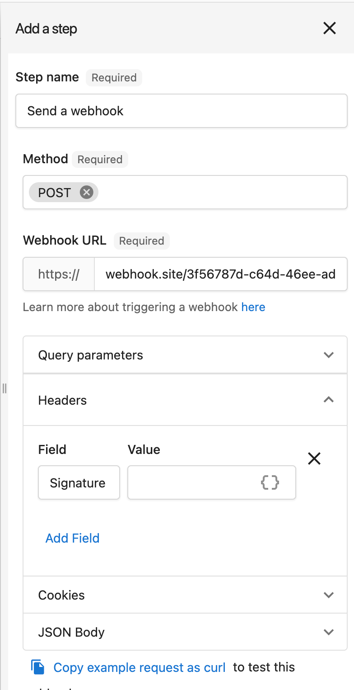
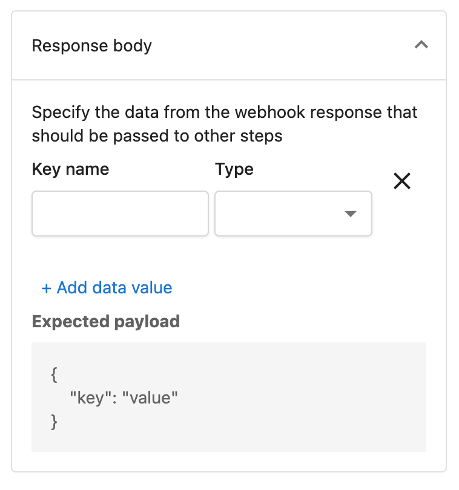

# Use the send a webhook action

You can take action in your systems based on events in the Vendasta platform by using automations. With any automation you can add the `Send a webhook` step to be notified when something happens. 

> The Send a webhook step replaces the Trigger a webhook step, providing more flexible request definition. 

## Overview

In this guide we will create an automation, listen for the event and retrieve details of the affected records.

## Prerequisites

This guide assumes you are familiar with creating automations within the platform. If you are not familiar you should [learn more about automations](https://support.vendasta.com/hc/en-us/categories/24285550627223-Automations) first.


## Step 1: Automation setup

Navigate to Partner Center &rarr; Automations &rarr; Chose existing or Create new automation.

Add the `Send a webhook` step.



The **Webhook URL** will be an endpoint that you have built in [step 2](#step-2-setup-your-handler). It will likely be one of your web servers but could also be a 3rd party system like Zapier. 

For testing purposes [webhook.site](https://webhook.site/) is a great tool for viewing what is sent. You may also use a tool like [ngrok](https://ngrok.com/) to route requests to your local development computer.

You may customize the Query parameters, Headers, Cookies, and JSON Body. At this time, the request body, and expected response body is a single json object, and doesn't support nested json unless manually contructed.

>Be careful when including sensitive data. The requests are sent using https however we do not have a way to confirm the destination is under your team's control. Instead it is recommended to only send ids and then fetch up to date info using an API request. 

**Response Body**

Similar to many automation steps, the Send a Webhook step supports data passing. This means that you can provide data in your webhook response, and pass it on to the next Automation Step! Ensure you configure the expected response body structure in the Response body section, or the data will not be made available to later steps.



## Step 2: Setup your handler

On a webserver that you control you will want to set up an HTTP request handler that accepts POST requests.

### Step 2.1: Verify the request

It is suggested that you utilize a Signature in your header, and throw out any requests that you are unable to validate.

### Step 2.2: Parse the body

Next you can parse the request body as a JSON object.

**Example Body**
```json
{
  "accountId": "AG-1234567",
  "entityId": "AG-1234567:ORD-1234567",
  "marketId": "default",
  "orderId": "AG-1234567:ORD-1234567",
  "partnerId": "9YW9"
}
```


### Step 2.3: Do something

What you do here will depend on your goal. Most likely you will want to fetch up to date info for the affected record. See the below guide.

### Step 2.4: Return a response

Let us know that you received the request by responding with an appropriate HTTP status code. 


| code  | result  |
|-------|---------|
| 2xx | Success don't retry |
| 4XX | An error occurred do not retry as it will never be successful |
| 5XX | A transient error occurred, retry  |


The webhook may be resent automatically for a few reasons:
- You took more than 60 seconds to respond to the request
- The HTTP response code was >= 500
- The connection was broken before we processed the response

If you require more than 60 seconds to process the webhook you should start a background workflow to do the processing. (We are fans of the [Temporal](https://www.temporal.io/) workflow engine.)


## Optional: Fetch up to date info

Various resource ids could be passed in the request body, which you can utilize to fetch up to date info via API. Here are a few examples.

The first step for all of them is to [create an access token](../../Authorization/CallingAPIs.md) with the needed scope(s).

### Order

The [get order operation](../../../openapi/platform/platform.yaml/paths/~1orders~1{id}/get) can be used with the value from the `orderId` field.

<!--
type: tab
title: Example Request
-->

```json http
{
  "method": "get",
  "url": "https://prod.apigateway.co/platform/orders/{orderId}",
  "headers": {
    "Authorization": "Bearer <Token with `order` scope>"
  }
}
```

<!--
type: tab
title: Response
-->
```json
{
  "data": {
    "type": "orders",
    "id": "AG-7PQTGLLXQQ:ORD-S548DKHMKX",
    "attributes": {
      "lineItems": [
        {
          "sku": "MP-fba21121b71148c9bb33e11fcd92d520",
          "quantity": 1,
          "amount": 5300,
          "intervalCode": "monthly",
          "isPackage": false,
          "containedInPackage": ""
        }
      ],
      "currencyCode": "AUD",
      "statusCode": "draft"
    },
    "relationships": {
      "businessLocation": {
        "links": {
          "related": "https://demo.apigateway.co/platform/orders/AG-7PQTGLLXQQ:ORD-S548DKHMKX/businessLocation",
          "self": "https://demo.apigateway.co/platform/orders/AG-7PQTGLLXQQ:ORD-S548DKHMKX/relationships/businessLocation"
        },
        "data": {
          "type": "businessLocations",
          "id": "AG-7PQTGLLXQQ"
        }
      },
      "customFields": {
        "links": {
          "related": "https://demo.apigateway.co/platform/orders/AG-7PQTGLLXQQ:ORD-S548DKHMKX/customFields",
          "self": "https://demo.apigateway.co/platform/orders/AG-7PQTGLLXQQ:ORD-S548DKHMKX/relationships/customFields"
        }
      }
    }
  }
}
```
<!-- type: tab-end -->

### Sales Account

The [get sales account operation](../../../openapi/platform/platform.yaml/paths/~1salesAccounts~1{id}/get) can be used with the value from the `accountId` field.

```json http
{
  "method": "get",
  "url": "https://prod.apigateway.co/platform/salesAccounts/{accountId}",
  "headers": {
    "Authorization": "Bearer <Token with `sales.account` scope>"
  }
}
```

### User

For automations that are trigged for a specific user you may use the [get user operation](../../../openapi/platform/platform.yaml/paths/~1users~1{id}/get) with the value from the `userId` field.

<!--
type: tab
title: Example Request
-->

```json http
{
  "method": "get",
  "url": "https://prod.apigateway.co/platform/users/{userId}",
  "query": {
    "fields[users]":"email,displayName"
  },
  "headers": {
    "Authorization": "Bearer <Token with `user.admin` scope>"
  }
}
```

<!--
type: tab
title: Response
-->
```json
{
    "data": {
        "type": "users",
        "id": "U-a6d23f70-fd09-43d2-91d2-a12c032caaa1",
        "attributes": {
            "displayName": "William Smith",
            "email": "bill@example.com"
        }
    }
}
```
<!-- type: tab-end -->
