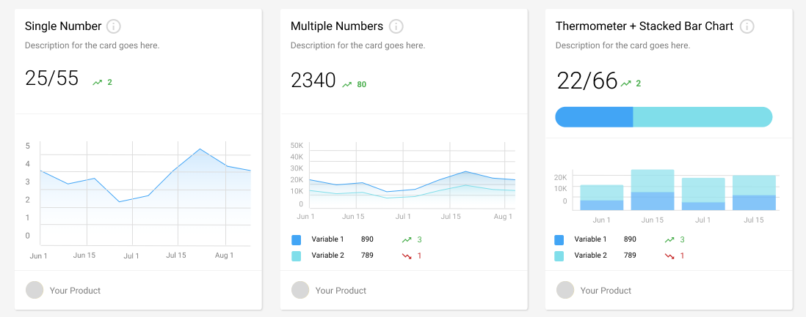
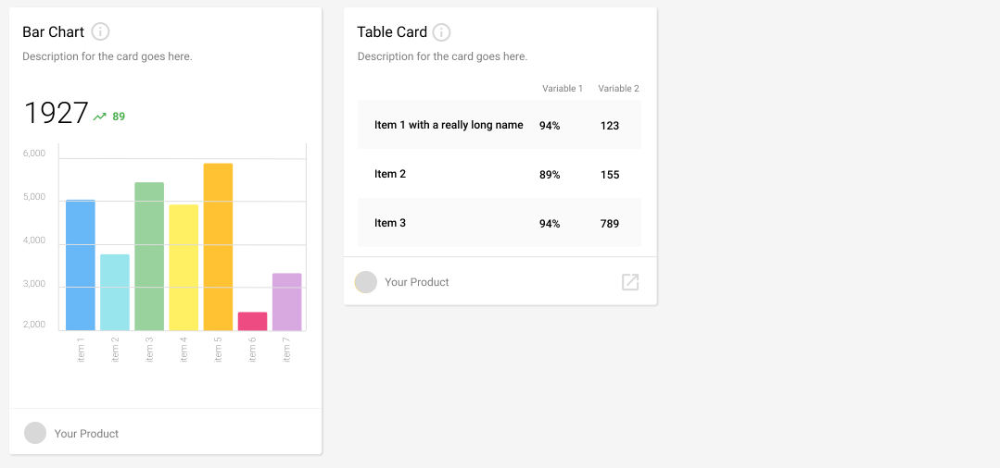
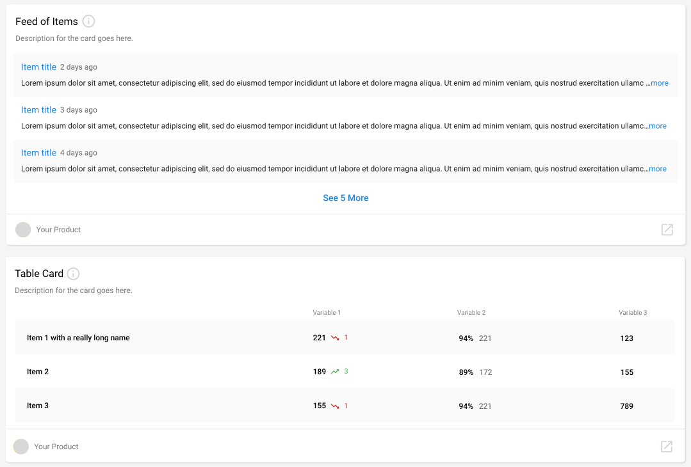

# vAnalytics API

This documentation provides Vendasta Partners and Vendors with the ability to send their data to our platform, where it will be used to generate cards for the Executive Report(both single and multi-location), in a new scalable way that supports slicing and rolling up reporting in any way that users need.

You will not need to pre-aggregate your data and insert it into our card templates to be sent weekly or monthly. You can send data as often as you can, and we will aggregate the data for you based on your provided tags.
## Data story design

The most important part of putting analytics into the client-facing reporting, is designing the cards to tell a clear, understandable story. Start by determining what metrics you can share that will be most valuable to someone wanting to know what kind of value, and ROI your product provides to them on a regular basis. Then design your metric cards, and decide exactly what data you need to push to support those cards.

Please mock up what your cards will exactly look like, including any text and labels, using [this template of available card styles](https://xd.adobe.com/view/0d62f2fa-c38b-4c23-8380-a20f0ff63cdb-5831/). Once mocked up, please share these mocks with our team to confirm compatibility with the report, as we will be implementing these cards on our side on your behalf. If you believe that a visualization other than what we have provided would best suit your data, please let us know, and we can evaluate your suggestions for new card types.

## Acceptable Card Styles

Currently, Vendasta developers will implement these cards on our end, once your data is appearing in our database. In the future, we will allow partners to choose and implement these cards themselves, into reporting.



 

\**currently strings are not supported, thus list cards as featured above will come at a later date*

## **API Usage**  

### Data Submission Frequency

Depending on the type of data we generally recommend either one data point per day, or creating data points sporadically as they occur. 

For example, marketing campaign analytics data (like opens, clicks, and delivered numbers) would likely be submitted as they occur, or summarized daily.

### Data Structure

Data meant for a single purpose, and thus for a single *‘Card’* may be pushed to the vAnalytics API as a BusinessMetric. Different components of the Card are provided as a list of BusinessMetricPoints grouped by an *aggregationKey*. 

Note that the *BusinessMetrics* are only delivery containers for *BusinessMetricPoints*. The *Cards* are built off of aggregated *BusinessMetricPoints*, and these data points are what matter. 

#### Card Text

Card information required to be provided to Vendasta:

1) Label & aggregation keys used in the data design (required)  
2) Short description of card (required)  
3) Longer tooltip description if needed (optional)
4) Style (required)


## Endpoints

For full details on these endpoints see [vAnalytics](5279e486cb47d-vanalytics-open-api-documentation).

### Push Business Metric


Currently integer values designated by the **intval** key are the only data type available. This will support most basic card types. **strval** will be added in upcoming iterations. ***This means cards such as the List, and CTA won’t be supported in the current release.***

For fractions as seen in some of the example cards, submit numerator and denominator as separate points with separate aggregation keys. Specify that this is the case in your submission notes to the Vendasta team.

For decimals, submit them as Accountant integers, and specify in your submission notes to the Vendasta team if we should divide by 10 or 100.

*dateHappened* format YYYY-MM-DDTHH:MM:SSZ

<!--
type: tab
title: Request
-->

```json http
{
  "method": "POST",
  "url": "https://prod.apigateway.co/v1/business-metrics",
  "query": {},
  "headers": {
    "Authorization": "Bearer <Token with 'business.metrics' scope>",
    "Content-Type": "application/json"
  },
  "body": {
    "businessId": "AG-S52RVH8H6H",
    "label": "Campaigns System",
    "points": [
      {
        "dateHappened": "2020-02-05T15:04:05Z",
        "aggregationKey": "opens",
        "intval": "1"
      }
    ]
  }
}
```

<!--
type: tab
title: Response 200
-->

```json
{}
```

<!--
type: tab-end
-->

### Get a business metric point


<!--
type: tab
title: Request
-->

```json http
{
  "method": "POST",
  "url": "https://prod.apigateway.co/v1/business-metrics/point/get",
  "query": {},
  "headers": {
    "Authorization": "Bearer <Token with 'business.metrics' scope>",
    "Content-Type": "application/json"
  },
  "body": {
    "id": "8108fc06-f455-4089-b324-f743eac28acc"
  }
}
```

<!--
type: tab
title: Response 200
-->

```json
{
  "source": "MP-53PVQXQMDJKCFD4S2S7S2B4QMC44HQ6D",
  "businessId": "AG-X4GS56H8PN",
  "label": "Campaigns System",
  "value": "410",
  "dateHappened": "2020-02-24T00:00:00Z",
  "dateHappenedKey": "1582502400000000000",
  "id": "8108fc06-f455-4089-b324-f743eac28acc",
  "created": "0001-01-01T00:00:00Z",
  "deleted": false,
  "aggregationKey": "opens"
}
```

<!--
type: tab-end
-->

### Get a business metric


<!--
type: tab
title: Request
-->

```json http
{
  "method": "POST",
  "url": "https://prod.apigateway.co/v1/business-metrics/get",
  "query": {},
  "headers": {
    "Authorization": "Bearer <Token with 'business.metrics' scope>",
    "Content-Type": "application/json"
  },
  "body": {
    "businessId": "AG-S52RVH8H6H",
    "label": "Campaigns System",
    "dateRange": {
      "startDate": "2020-02-01T15:04:05Z",
      "endDate": "2020-02-10T15:04:05Z"
    },
    "cursor": "",
    "pageSize": "100"
  }
}
```

<!--
type: tab
title: Response 200
-->

```json
{
  "cursor": "",
  "metric": {
    "businessId": "AG-S52RVH8H6H",
    "label": "Campaigns System",
    "points": [
      {
        "dateHappened": "2020-02-03T15:04:05Z",
        "aggregationKey": "opens",
        "intval": "1",
        "id": "c41be4e0-8bd6-4d3a-acc9-5575421d8ebf"
      },
      {
        "dateHappened": "2020-02-04T15:04:05Z",
        "aggregationKey": "opens",
        "intval": "1",
        "id": "316ea912-3a05-4a14-a237-3a9bb1c3028f"
      }
    ]
  }
}
```

<!--
type: tab-end
-->

### Delete business metric point


<!--
type: tab
title: Request
-->

```json http
{
  "method": "POST",
  "url": "https://prod.apigateway.co/v1/business-metrics/delete",
  "query": {},
  "headers": {
    "Authorization": "Bearer <Token with 'business.metrics' scope>",
    "Content-Type": "application/json"
  },
  "body": {
    "id": "3143a075-701b-4067-9115-6e472f44c30f"
  }
}
```

<!--
type: tab
title: Response 200
-->

```json
{}
```

<!--
type: tab
title: Response 404
-->

```json
{
  "code": 1,
  "message": "BusinessMetric with ID 8736e8de-09a7-4fab-8b7e-31414ef4769a is deleted"
}
```

<!--
type: tab-end
-->

### Delete business metrics points


<!--
type: tab
title: Request
-->

```json http
{
  "method": "POST",
  "url": "https://prod.apigateway.co/v1/business-metrics/delete-multi",
  "query": {},
  "headers": {
    "Authorization": "Bearer <Token with 'business.metrics' scope>",
    "Content-Type": "application/json"
  },
  "body": {
    "businessMetrics": [
      {
        "id": "b808aa37-44b1-4678-a54a-0f3d38381887"
      },
      {
        "id": "d2187725-1960-4d74-91a0-e7915ac7c13b"
      },
      {
        "id": "3143a075-701b-4067-9115-6e472f44c30f"
      },
      {
        "id": "3143a075-701b-4067-9115-xxxx"
      }
    ]
  }
}
```

<!--
type: tab
title: Response 200
-->

```json
{
  "businessMetrics": [
    {
      "id": "3143a075-701b-4067-9115-xxxx",
      "error": {
        "code": "1",
        "message": "BusinessMetric with ID 3143a075-701b-4067-9115-xxxx does not exist"
      }
    },
    {
      "id": "d2187725-1960-4d74-91a0-e7915ac7c13b",
      "error": {
        "code": "1",
        "message": "BusinessMetric with ID d2187725-1960-4d74-91a0-e7915ac7c13b is deleted"
      }
    },
    {
      "id": "3143a075-701b-4067-9115-6e472f44c30f",
      "error": {
        "code": "1",
        "message": "BusinessMetric with ID 3143a075-701b-4067-9115-6e472f44c30f is deleted"
      }
    },
    {
      "id": "b808aa37-44b1-4678-a54a-0f3d38381887"
    }
  ]
}
```

<!--
type: tab-end
-->

## Examples

### Single Number

A single BusinessMetric

```json http
{
  "method": "POST",
  "url": "https://prod.apigateway.co/v1/business-metrics",
  "query": {},
  "headers": {
    "Authorization": "Bearer <Token with 'business.metrics' scope>",
    "Content-Type": "application/json"
  },
  "body": {
    "businessId": "AG-XXXXXXXX",
    "label": "Campaigns System",
    "points": [
      {
        "dateHappened": "2021-01-05T15:04:05Z",
        "aggregationKey": "opens",
        "intval": "3"
      },
      {
        "dateHappened": "2021-01-05T15:04:05Z",
        "aggregationKey": "clicks",
        "intval": "4"
      }
    ]
  }
}
```

The same data provided via multiple requests:

Request 1: 

```json http
{
  "method": "POST",
  "url": "https://prod.apigateway.co/v1/business-metrics",
  "query": {},
  "headers": {
    "Authorization": "Bearer <Token with 'business.metrics' scope>",
    "Content-Type": "application/json"
  },
  "body": {
    "businessId": "AG-XXXXXXXX",
    "label": "Campaigns System",
    "points": [
      {
        "dateHappened": "2021-01-05T15:04:05Z",
        "aggregationKey": "opens",
        "intval": "3"
      }
    ]
  }
}
```

Request 2:

```json http
{
  "method": "POST",
  "url": "https://prod.apigateway.co/v1/business-metrics",
  "query": {},
  "headers": {
    "Authorization": "Bearer <Token with 'business.metrics' scope>",
    "Content-Type": "application/json"
  },
  "body": {
    "businessId": "AG-XXXXXXXX",
    "label": "Campaigns System",
    "points": [
      {
        "dateHappened": "2021-01-05T15:04:05Z",
        "aggregationKey": "clicks",
        "intval": "4"
      }
    ]
  }
}
```
