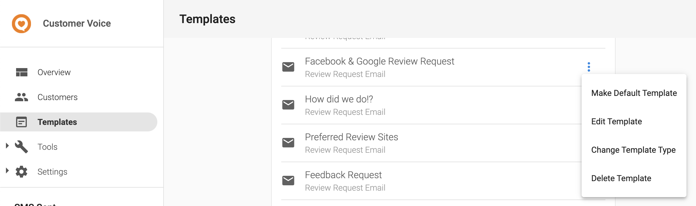

# Request a Review for a Business Location

> This guide relies on "Proposed" endpoints and is likely to change until all features have been made generally available.

With Customer Voice, you can gather authentic reviews via email or text on the sites that matter most, to grow customer loyalty and boost sales.

## Setup
Create an access token with `reviews` and `customers` scopes following the [Authorization guide](../../Authorization/Authorization.md).

Have an activated Customer Voice product and SMS add-on if you need to send SMS review requests. Ensure your email and SMS templates are configured appropriately and your preferred review sites are configured within the Customer Voice platform.

## Step 1: Obtain a Vendasta Customer ID
In order to track the status of a review request within Customer Voice, a Vendasta customer record must exist and the id of this record must be provided. To sync contact information from your system to Vendasta's you can use the `/business/customers` endpoint.
<!--
type: tab
title: Request
-->
``` json http
{
  "method": "POST",
  "url": "https://prod.apigateway.co/business/customers",
  "query": {},
  "headers": {
    "Authorization": "Bearer <Token with 'customers' scope>",
    "Content-Type": "application/vnd.api+json"
  },
  "body": {
    "data": {
      "type": "customers",
      "attributes": {
        "givenName": "William",
        "familyName": "Smith",
        "address": {
          "streetAddress": "123 Fake St.",
          "city": "Kalamazoo",
          "regionCode": "US-MI",
          "countryCode": "US"
        },
        "phoneNumbers": [
          "+13065551234"
        ],
        "emailAddresses": [
          "example@email.com"
        ],
        "tags": [
          "2021 Christmas Campaign"
        ],
        "permissionToContact": true
      },
      "relationships": {
        "businessLocation": {
          "data": {
            "id": "AG-123"
          }
        }
      }
    }
  }
}
```
<!--
type: tab
title: Customer Created Response
-->
If the contact information you provide is valid, it will create a new customer record in Vendasta's system and return the newly created record.
```json
{
  "type": "customers",
  "id": "AG-123:CUSTOMER-123",
  "attributes": {
    "givenName": "William",
    "familyName": "Smith",
        "address": {
          "streetAddress": "123 Fake St.",
          "city": "Kalamazoo",
          "regionCode": "US-MI",
          "countryCode": "US"
        },
    "phoneNumbers": [
      "+13065551234"
    ],
    "emailAddresses": [
      "example@email.com"
    ],
    "tags": [
      "2021 Christmas Campaign"
    ],
    "permissionToContact": true,
    "createdAt": "2019-08-24T14:15:22Z",
    "updatedAt": "2019-08-24T14:15:22Z"
  },
  "relationships": {
    "businessLocation": {
      "data": {
        "type": "businessLocation",
        "id": "AG-123"
      }
    }
  }
}
```
<!--
type: tab
title: Customer Conflict Response
-->
If a customer with a matching email or phone number already exists in Vendasta's system for a business location, the endpoint will return a `409 Conflict` error with information on the conflicting attribute and the id of the existing customer record.
```json
{
    "errors": [
        {
              "status": 409,
              "title": "Conflict",
              "details": "A Customer with the phone number +13065551234 already exists",
              "meta": {
                "conflictingCustomerId": "AG-123:CUSTOMER-456"
              }
        }
    ],
    "meta": {
        "requestId": "123"
    },
    "links": {
        "self": {
            "href": "/business/customers"
        }
    }
}
```
<!--
type: tab-end
-->


## Step 2: Obtain a Template ID
Templates control the text and layout of your review request and can be configured to dynamically populate fields from your business information, a customer record or your preferred review sites. 

To obtain a template id, navigate to the "Templates" tab and select "Edit Template" from the configuration menu of your chosen template. 


Scrolling to the bottom of the "Edit Template" page you will see a button for copying the template ID.


When sending a review request you can also provide a "fallback" template to use in the case where we are unable to send a review request with the primary template. This may occur if, for example, sending the review request would cause you to exceed your monthly SMS limit. If an email fallback template is provided we would send an email review request instead.

## Step 3: Create a Review Request
<!--
type: tab
title: Request
-->
Using your generated access token in your `Authorization` header, the Vendasta customer ID and template IDs you can make a `POST` request to send a review request. Notice that the ids provided in the request body contain several ids joined together with ":". For the customer id add the [business ID](../Accounts.md) of the business location you are sending the review request for to the start of your Vendasta customer id. For the template id add the business ID as well as the template type (either "email" or "sms") to the beginning of your template id.

```json http
{
  "method": "POST",
  "url": "https://prod.apigateway.co/products/reviews/reviewRequests",
  "query": {},
  "headers": {
    "Authorization": "Bearer <Token with 'reviews' scope>",
    "Content-Type": "application/vnd.api+json"
  },
  "body": {
     "data": {
        "relationships": {
          "customer": {
            "data": {
              "id": "AG-abc123:CUSTOMER-003c26eb-f940-48c6-a5dc-xxxxxxxxxxxx",
            }
          },
          "primaryTemplate": {
            "data": {
              "id": "AG-abc123:sms:TEM-d2f4cf1aa7ae480bbf0a2da67dxxxxxx",
            }
          },
          "fallbackTemplate": {
            "data": {
              "id": "AG-abc123:email:TEM-d2f4cf1aa7ae480bbf0a2da67dxxxxxx",
            }
          }
        }
    }
  }
}
```
<!--
type: tab
title: Example Response
-->
```json
{
  "id": "RQT-00003fa2-bd72-40c2-9101-xxxxxxxxxxxx",
  "type": "reviewRequest",
  "attributes": {
    "requestType": "email",
    "status": "sending",
    "createdAt": "2019-08-24T14:15:22Z",
    "updatedAt": "2019-08-24T14:15:22Z"
  },
  "relationships": {
    "customer": {
      "data": {
        "id": "AG-abc123:CUSTOMER-003c26eb-f940-48c6-a5dc-xxxxxxxxxxxx",
        "type": "customer"
      }
    },
    "primaryTemplate": {
      "data": {
        "id": "AG-abc123:sms:TEM-d2f4cf1aa7ae480bbf0a2da67dxxxxxx",
        "type": "template"
      }
    },
    "fallbackTemplate": {
      "data": {
        "id": "AG-abc123:email:TEM-d2f4cf1aa7ae480bbf0a2da67dxxxxxx",
        "type": "template"
      }
    }
  }
}
```
<!--
type: tab-end
-->