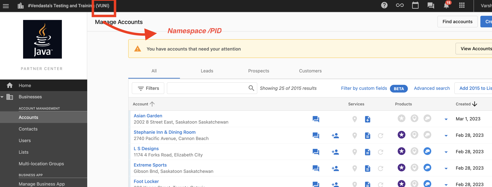

# Guide to use Vendasta SCIM APIs to sync Users


## Overview
System for Cross-domain Identity Management ([SCIM](https://en.wikipedia.org/wiki/System_for_Cross-domain_Identity_Management)) focuses on syncing user accounts and permissions between systems but has an extension system that allows syncing any type of record. There are several well known endpoint paths for discovering what the server supports and resource schema definitions.

This guide provides the information of

- To create a service account in vendasta and authorization token to access vendasta APIs
- List of Vendasta SCIM APIs and the way to use it.


## Step 1 : Pre-requisites for accessing the Vendasta's SCIM APIs

### 1. Namespace

This must be the id of the partner that wish to manage users in sync with Vendasta. It should be unique for a partner.

The users access Partner Center is that when a new Channel Partner signs up a new Partner is created and this generates a PID. The PID is then set as the namespace of all the SCIM Users. 





### 2. Authorization token
- For a partner with Vendasta, in order to access APIs of Vendasta you must need a authorisation token which is generated against the namespace of the partner. This should be refreshed over a particular time.

- The authorization token must be generated with required scopes in order to access a particular platform. Here "user.admin" is the required scope which is mandatory for each token. 


> To create a service account and create a token , see [here](../../Authorization/2-legged-oauth/Overview.md).


## Step 2 : Vendasta SCIM Endpoints to sync users

A [schema](https://www.ibm.com/docs/en/odi?topic=apis-schema-api) is a metadata that tells us how our data is structured. Most databases implement some form of schema which enables us to reason about our data in a more structured manner. 

We support a [User schema](../../../openapi/scim/scim.yaml/paths/~1{namespace}~1Schemas) which is used in our SCIM APIs.
Also the [System Operation](../../../openapi/scim/scim.yaml/paths/~1{namespace}~1ResourceTypes) section which will expose all of our supported configurations.


### Create User

When you want to add a new user, then you can use this API to make a POST request to create a new user by providing the required field.
After this operation completes, the user will be added.

If the user already exists then it will throw an error.

```json http
{
  "method": "POST",
  "url": "/scim/{namespace}/Users",
  "headers": {
    "Authorization": "Bearer <Access Token with 'user.admin' scope>",
    "Content-Type": "application/json"
  },
  "body": {
    "schemas": [
    "urn:ietf:params:scim:schemas:core:2.0:User"
    ],
    "id": "string",
    "externalId": "string",
    "userName": "barbara@mail.com",
    "name": {
      "familyName": "Jensen",
      "givenName": "Barbara",
      "middleName": "Jane",
      "honorificPrefix": "Ms.",
      "honorificSuffix": "III"
    },
    "nickName": "Babs",
    "profileUrl": "http://example.com",
    "title": "string",
    "userType": "string",
    "preferredLanguage": "string",
    "locale": "string",
    "timezone": "America/Regina",
    "emails": [
      {
        "value": "bjensen@example.com",
        "type": "work",
        "primary": true
      }
    ],
    "active": true,
    "password": "string",
    "addresses": [
      {
        "type": "work",
        "streetAddress": "100 Universal City Plaza",
        "locality\"": "Hollywood",
        "region": "CA-SK",
        "postalCode": "91608",
        "country": "CA",
        "formatted": "100 Universal City Plaza\\nHollywood, CA-SK 91608 CA",
        "primary": true
      }
    ],
    "phoneNumbers": [
      {
        "value": "+1-306-555-1234",
        "type": "work"
      }
    ],
    "groups": [
      {
        "value": "2819c223-7f76-453a-919d-413861904646",
        "$ref": "https://example.com/v2/Users/2819c223-7f76-453a-919d-413861904646",
        "display": "Babs Jensen"
      }
    ],
    "meta": {
      "resourceType": "User",
      "created": "2010-01-23T04:56:22Z",
      "lastModified": "2011-05-13T04:42:34Z",
      "version": "W/\"3694e05e9dff591\"",
      "location": "https://example.com/v2/Users/2819c223-7f76-453a-919d-413861904646"
    }
  }
}
```
For full details on the available fields see [here](../../../openapi/scim/scim.yaml/paths/~1{namespace}~1Users)

### Check for an existing user
If another user already exists within your platform with the same email address you will get an error when trying to create a new user. 

You can search for an existing user by vendasta id by making a GET request.

If there is no user with the given ID then it would throw an error with “Resource not found” message.

```json http
{
  "method": "get",
  "url": "/scim/{namespace}/Users/{id}",
  "headers": {
    "Authorization": "Bearer <Access Token with 'user.admin' scope>",
    "Content-Type": "application/json"
  }
}
```

For full details on the available fields see [here](../../../openapi/scim/scim.yaml/paths/~1{namespace}~1Users~1{id})

### Search users with different filter options

You can search users based on various filters by making a GET request.
After this operation completes, list of users based on given filters will be returned. 

#### With no filters 

The Endpoint will return all the available Users if we does not provide any filter options

```json http
{
  "method": "get",
  "url": "/scim/{namespace}/Users",
  "headers": {
    "Authorization": "Bearer <Access Token with 'user.admin' scope>",
    "Content-Type": "application/json"
  }
}
```

#### Filter with Email or external id

You use a query named "filter" to filter out using external ID or the user Email id

```json http
{
  "method": "get",
  "url": "/scim/{namespace}/Users",
  "headers": {
    "Authorization": "Bearer <Access Token with 'user.admin' scope>",
    "Content-Type": "application/json"
  },
  "query": {
    "filter": "externalId eq \"user_external_id\" or userName eq \"user@mail.com\"",
  },
}
```

You can even add the count per page, starting index, and sort options 

```json http
{
  "method": "get",
  "url": "/scim/{namespace}/Users",
  "headers": {
    "Authorization": "Bearer <Access Token with 'user.admin' scope>",
    "Content-Type": "application/json"
  },
  "query": {
    "count": "10",
    "startIndex": "1",
    "sortOrder": "ascending",
    "sortBy" : "userName",
  },
}
```

You can Customize the attributes in the search Response by providing these query values


```json http
{
  "method": "get",
  "url": "/scim/{namespace}/Users",
  "headers": {
    "Authorization": "Bearer <Access Token with 'user.admin' scope>",
    "Content-Type": "application/json"
  },
  "query": {
    "attributes": "id,externalId,familyName,givenName",
    "excludedAttributes": "familyName,addresses",
    
  },
}
```

> All the query values in Search API is optional


For full details on the available fields see [here](../../../openapi/scim/scim.yaml/paths/~1{namespace}~1Users)


### Update User

You can update any existing user by making a PATCH request. One or more attributes could be updated by providing operation path and value.
After this operation completes, the provided attributes will be updated and all other attributes remains unchanged.

If there is no user with the given ID then it would throw an error.
```json http
{
  "method": "PATCH",
  "url": "/scim/{namespace}/Users/{id}",
  "headers": {
    "Authorization": "Bearer <Access Token with 'user.admin' scope>",
    "Content-Type": "application/json"
  },
  "body": {
    "schemas": [
      "urn:ietf:params:scim:api:messages:2.0:PatchOp"
    ],
    "Operations": [
      {
        "op": "Replace",
        "path": "emails[type eq \"work\"].value",
        "value": "updatedEmail@mail.com"
      }
    ]
  }
}
```

For full details on the available fields see [here](../../../openapi/scim/scim.yaml/paths/~1{namespace}~1Users~1{id})


### Replace User

You can replace any existing user by making a PUT request.
After this operation completes, all of the attributes for the user will be replaced with provided value and attributes will be kept blank for which no value is specified.

If there is no user with the given ID then it would throw an error.

```json http
{
  "method": "PUT",
  "url": "/scim/{namespace}/Users/{id}",
  "headers": {
    "Authorization": "Bearer <Access Token with 'user.admin' scope>",
    "Content-Type": "application/json"
  },
  "body":{
    "schemas": [
      "urn:ietf:params:scim:schemas:core:2.0:User"
    ],
    "id": "string",
    "externalId": "string",
    "userName": "barbara@mail.com",
    "name": {
      "familyName": "Jensen",
      "givenName": "Barbara",
      "middleName": "Jane",
      "honorificPrefix": "Ms.",
      "honorificSuffix": "III"
    },
    "nickName": "Babs",
    "profileUrl": "http://example.com",
    "title": "string",
    "userType": "string",
    "preferredLanguage": "string",
    "locale": "string",
    "timezone": "America/Regina",
    "emails": [
      {
        "value": "bjensen@example.com",
        "type": "work",
        "primary": true
      }
    ],
    "active": true,
    "password": "string",
    "addresses": [
      {
        "type": "work",
        "streetAddress": "100 Universal City Plaza",
        "locality\"": "Hollywood",
        "region": "CA-SK",
        "postalCode": "91608",
        "country": "CA",
        "formatted": "100 Universal City Plaza\\nHollywood, CA-SK 91608 CA",
        "primary": true
      }
    ],
    "phoneNumbers": [
      {
        "value": "+1-306-555-1234",
        "type": "work"
      }
    ],
    "groups": [
      {
        "value": "2819c223-7f76-453a-919d-413861904646",
        "$ref": "https://example.com/v2/Users/2819c223-7f76-453a-919d-413861904646",
        "display": "Babs Jensen"
      }
    ],
    "meta": {
      "resourceType": "User",
      "created": "2010-01-23T04:56:22Z",
      "lastModified": "2011-05-13T04:42:34Z",
      "version": "W/\"3694e05e9dff591\"",
      "location": "https://example.com/v2/Users/2819c223-7f76-453a-919d-413861904646"
    }
  }
}
```
For full details on the available fields see [here](../../../openapi/scim/scim.yaml/paths/~1{namespace}~1Users~1{id})

### Delete User

You can remove an existing user by making a DELETE request using delete user API with the required field “USER ID”
After this operation completes, the user will be removed.

If there is no user with the given ID in that case it would throw an error stating that “Resource not found”.

```json http
{
  "method": "delete",
  "url": "	/scim/{namespace}/Users/{id}",
  "headers": {
    "Authorization": "Bearer <Access Token with 'user.admin' scope>",
    "Content-Type": "application/json"
  }
}
```

For full details on the available fields see [here](../../../openapi/scim/scim.yaml/paths/~1{namespace}~1Users~1{id})


## External ID 
It is an external unique identifier of the user in partner side. You can use it as an optional field which will be stored if you wish to have an external unique identifier (should be sent by partner).