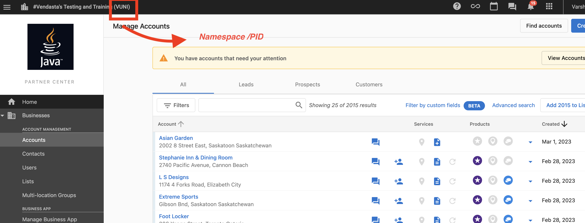

# Guide to use Vendasta SCIM APIs to sync Users


## Overview
System for Cross-domain Identity Management ([SCIM](https://en.wikipedia.org/wiki/System_for_Cross-domain_Identity_Management)) focuses on syncing user accounts and permissions between systems but has an extension system that allows syncing any type of record.

This guide provides the information of

- To create a service account in Vendasta and authorization token to access Vendasta APIs
- List of Vendasta SCIM APIs and the way to use it.


## Step 1 : Pre-requisites for accessing the Vendasta's SCIM APIs

### 1. Namespace

You need a namespace which is your Vendasta partner id and it is unique for each partner, this partner id is generated when a new channel partner signs up to Vendasta.




The namespace in the URL — not the user's own partner — decides what each request can see and change. A user belongs to your namespace when they hold at least one role there, or when it is their **home namespace**, the partner they were originally created under. A request for a user who is not in your namespace returns `404`, even when that user exists elsewhere on the Vendasta platform, and a user's `groups` only ever lists the roles they hold in your namespace.


### 2. Authorization token

You need a authorization token to access Vendasta APIs which should be generated against your namespace with required scope "user.admin"

> To create a service account and create a token , see [here](../../Authorization/2-legged-oauth/Overview.md).


## Step 2 : Vendasta SCIM Endpoints to sync users

We support set of [fields](../../../openapi/scim/scim.yaml/paths/~1{namespace}~1Schemas) which is used in our SCIM APIs.
Also the [System Operation](../../../openapi/scim/scim.yaml/paths/~1{namespace}~1ResourceTypes) section which will expose all of our supported configurations.


### Check for an existing user 

#### 1. By Vendasta ID
You can search for an existing user by Vendasta id by making a GET request.


If there is no user with the given ID, or that user is not in your namespace, you will get a `404` with a “Resource not found” message.

```json http
{
  "method": "get",
  "url": "https://prod.apigateway.co/scim/{namespace}/Users/{id}",
  "headers": {
    "Authorization": "Bearer <Access Token with 'user.admin' scope>",
    "Content-Type": "application/scim+json"
  }
}
```

#### 2. By Email id

You can search for an existing user by email id by making a GET request.

You use a query named "filter" to filter out using the user Email id.

A lookup for a user who is not in your namespace returns an empty list — `totalResults` of `0` — rather than a `404`.

```json http
{
  "method": "get",
  "url": "https://prod.apigateway.co/scim/{namespace}/Users",
  "headers": {
    "Authorization": "Bearer <Access Token with 'user.admin' scope>",
    "Content-Type": "application/scim+json"
  },
  "query": {
    "filter": "userName eq \"user@mail.com\"",
  },
}
```
### Create User

When you want to add a new user, then you can use this API to make a POST request to create a new user by providing the required field.
After this operation completes, the user will be added.

If the user already exists then it will throw an error.

```json http
{
  "method": "POST",
  "url": "https://prod.apigateway.co/scim/{namespace}/Users",
  "headers": {
    "Authorization": "Bearer <Access Token with 'user.admin' scope>",
    "Content-Type": "application/scim+json"
  },
  "body": {
    "schemas": [
    "urn:ietf:params:scim:schemas:core:2.0:User"
    ],
    "id": "2819c223-7f76-453a-919d-413861904646",
    "externalId": "test-scim-external-id",
    "userName": "barbara@mail.com",
    "name": {
      "familyName": "Jensen",
      "givenName": "Barbara",
      "middleName": "Jane",
      "honorificPrefix": "Ms.",
      "honorificSuffix": "III"
    },
    "nickName": "Babs",
    "profileUrl": "http://example.com",
    "title": "Vice President",
    "userType": "Employee",
    "preferredLanguage": "english",
    "locale": "en-US",
    "timezone": "America/Regina",
    "emails": [
      {
        "value": "bjensen@example.com",
        "type": "work",
        "primary": true
      }
    ],
    "active": true,
    "password": "1234567A",
    "addresses": [
      {
        "type": "work",
        "streetAddress": "100 Universal City Plaza",
        "locality\"": "Hollywood",
        "region": "CA-SK",
        "postalCode": "91608",
        "country": "CA",
        "formatted": "100 Universal City Plaza\\nHollywood, CA-SK 91608 CA",
        "primary": true
      }
    ],
    "phoneNumbers": [
      {
        "value": "+1-306-555-1234",
        "type": "work"
      }
    ],
    "meta": {
      "resourceType": "User",
      "created": "2010-01-23T04:56:22Z",
      "lastModified": "2011-05-13T04:42:34Z",
      "version": "W/\"3694e05e9dff591\"",
      "location": "https://example.com/v2/Users/2819c223-7f76-453a-919d-413861904646"
    }
  }
}
```
For full details on the available fields see [here](../../../openapi/scim/scim.yaml/paths/~1{namespace}~1Users)


> If another user already exists within your platform with the same email address you will get an error when trying to create a new user. 


For full details on the available fields see [here](../../../openapi/scim/scim.yaml/paths/~1{namespace}~1Users~1{id})

### Search users with different filter options

You can search users based on various filters by making a GET request.
After this operation completes, list of users based on given filters will be returned. 

#### With no filters 

The Endpoint will return all the available Users if we does not provide any filter options

```json http
{
  "method": "get",
  "url": "https://prod.apigateway.co/scim/{namespace}/Users",
  "headers": {
    "Authorization": "Bearer <Access Token with 'user.admin' scope>",
    "Content-Type": "application/scim+json"
  }
}
```

#### Filter with Email or external id

You use a query named "filter" to filter out using external ID or the user Email id

```json http
{
  "method": "get",
  "url": "https://prod.apigateway.co/scim/{namespace}/Users",
  "headers": {
    "Authorization": "Bearer <Access Token with 'user.admin' scope>",
    "Content-Type": "application/scim+json"
  },
  "query": {
    "filter": "externalId eq \"user_external_id\" or userName eq \"user@mail.com\"",
  },
}
```

You can even add the count per page, starting index, and sort options 

```json http
{
  "method": "get",
  "url": "https://prod.apigateway.co/scim/{namespace}/Users",
  "headers": {
    "Authorization": "Bearer <Access Token with 'user.admin' scope>",
    "Content-Type": "application/scim+json"
  },
  "query": {
    "count": "10",
    "startIndex": "1",
    "sortOrder": "ascending",
    "sortBy" : "userName",
  },
}
```

You can Customize the attributes in the search Response by providing these query values


```json http
{
  "method": "get",
  "url": "https://prod.apigateway.co/scim/{namespace}/Users",
  "headers": {
    "Authorization": "Bearer <Access Token with 'user.admin' scope>",
    "Content-Type": "application/scim+json"
  },
  "query": {
    "attributes": "id,externalId,familyName,givenName",
    "excludedAttributes": "familyName,addresses",
    
  },
}
```

> All the query values in Search API is optional


For full details on the available fields see [here](../../../openapi/scim/scim.yaml/paths/~1{namespace}~1Users)


### Update User

You can update any existing user by making a PATCH request. One or more attributes could be updated by providing operation path and value.
After this operation completes, the provided attributes will be updated and all other attributes remains unchanged.

If there is no user with the given ID then it would throw an error.
```json http
{
  "method": "PATCH",
  "url": "https://prod.apigateway.co/scim/{namespace}/Users/{id}",
  "headers": {
    "Authorization": "Bearer <Access Token with 'user.admin' scope>",
    "Content-Type": "application/scim+json"
  },
  "body": {
    "schemas": [
      "urn:ietf:params:scim:api:messages:2.0:PatchOp"
    ],
    "Operations": [
      {
        "op": "Replace",
        "path": "emails[type eq \"work\"].value",
        "value": "updatedEmail@mail.com"
      }
    ]
  }
}
```

For full details on the available fields see [here](../../../openapi/scim/scim.yaml/paths/~1{namespace}~1Users~1{id})


### Replace User

You can replace an existing user's profile by making a PUT request. Vendasta loads the stored user, overlays the profile attributes from your request body onto it, and saves the result.

- **A profile attribute you omit is cleared.** That covers `name.givenName`, `name.familyName`, `nickName`, `preferredLanguage`, `timezone`, `addresses` and `phoneNumbers` — and `displayName` with them, since it is derived from the two name parts. Send the complete profile on every PUT, or use PATCH to change one attribute without disturbing the rest.
- **Roles and group membership are preserved.** A PUT never grants or revokes access — platform features, business locations and business-feature access all survive unchanged, and a `groups` array in the body is ignored rather than applied.
- **`userName` and `emails` are not replaced.** A PUT cannot change a user's email address.
- **`externalId` is replaced, and omitting it clears it.** It is read from the body alone, so a PUT without an `externalId` blanks the mapping you use to find this user again. Always send it. PATCH does not behave this way — it leaves an untouched `externalId` alone.

If there is no user with the given ID, or that user is not in your namespace, you will get a `404`.

```json http
{
  "method": "PUT",
  "url": "https://prod.apigateway.co/scim/{namespace}/Users/{id}",
  "headers": {
    "Authorization": "Bearer <Access Token with 'user.admin' scope>",
    "Content-Type": "application/scim+json"
  },
  "body":{
    "schemas": [
      "urn:ietf:params:scim:schemas:core:2.0:User"
    ],
    "id": "2819c223-7f76-453a-919d-413861904646",
    "externalId": "test-scim-external-id",
    "userName": "barbara@mail.com",
    "name": {
      "familyName": "Jensen",
      "givenName": "Barbara",
      "middleName": "Jane",
      "honorificPrefix": "Ms.",
      "honorificSuffix": "III"
    },
    "nickName": "Babs",
    "profileUrl": "http://example.com",
    "title": "Vice President",
    "userType": "Contractor",
    "preferredLanguage": "english",
    "locale": "en-US",
    "timezone": "America/Regina",
    "emails": [
      {
        "value": "bjensen@example.com",
        "type": "work",
        "primary": true
      }
    ],
    "active": true,
    "password": "12Av5678",
    "addresses": [
      {
        "type": "work",
        "streetAddress": "100 Universal City Plaza",
        "locality\"": "Hollywood",
        "region": "CA-SK",
        "postalCode": "91608",
        "country": "CA",
        "formatted": "100 Universal City Plaza\\nHollywood, CA-SK 91608 CA",
        "primary": true
      }
    ],
    "phoneNumbers": [
      {
        "value": "+1-306-555-1234",
        "type": "work"
      }
    ],
    "meta": {
      "resourceType": "User",
      "created": "2010-01-23T04:56:22Z",
      "lastModified": "2011-05-13T04:42:34Z",
      "version": "W/\"3694e05e9dff591\"",
      "location": "https://example.com/v2/Users/2819c223-7f76-453a-919d-413861904646"
    }
  }
}
```
For full details on the available fields see [here](../../../openapi/scim/scim.yaml/paths/~1{namespace}~1Users~1{id})

### Delete User

You can remove a user from your namespace by making a DELETE request with their Vendasta user id.

**What this removes depends on whether your namespace is the user's home namespace** — the partner they were originally created under.

- **Not their home namespace.** Only the roles the user holds in your namespace are removed — platform features, business locations and business-feature access, along with the Partner Center, Business App and Task Manager records behind them. Their profile, their access under other partners and their Vendasta account are all left intact. Afterwards the user is no longer in your namespace, so later reads there return `404`.
- **Their home namespace.** This removes the user's Vendasta account. Their roles are stripped from every namespace they hold one in first, so no partner is left with orphaned records, and the account itself is then removed.

Both paths are permission-checked and return `403` when your service account is not allowed to change the user in that namespace.

If there is no user with the given ID, or that user is not in your namespace, you will get a `404` stating “Resource not found” — a delete is never silently accepted for a user who is not there.

A `5xx` means the teardown did not finish. Retrying a delete in the user's home namespace picks it up again. Retrying a delete in another namespace may instead return `404` — the roles removed before the failure can be enough to make the user absent there — and the user may still hold access the failed step never revoked. Treat a `5xx` on that path as needing follow-up, not as a transient error to retry away.

```json http
{
  "method": "delete",
  "url": "	https://prod.apigateway.co/scim/{namespace}/Users/{id}",
  "headers": {
    "Authorization": "Bearer <Access Token with 'user.admin' scope>",
    "Content-Type": "application/scim+json"
  }
}
```

For full details on the available fields see [here](../../../openapi/scim/scim.yaml/paths/~1{namespace}~1Users~1{id})


## External ID 
It is an external unique identifier of the user in partner side. You can use it as an optional field which will be stored if you wish to have an external unique identifier (should be sent by partner).