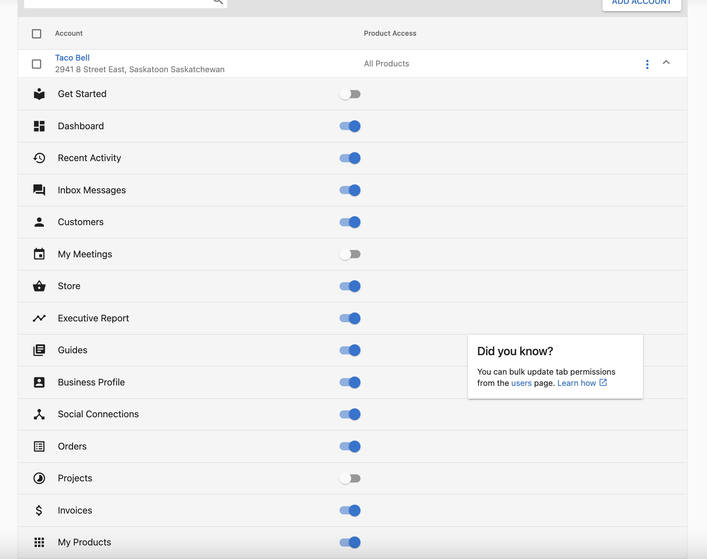
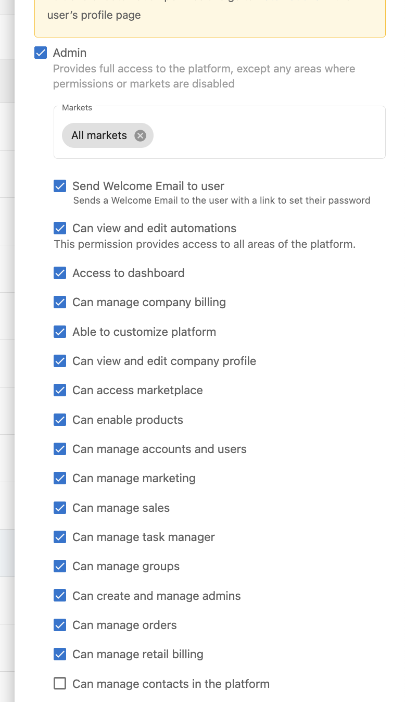
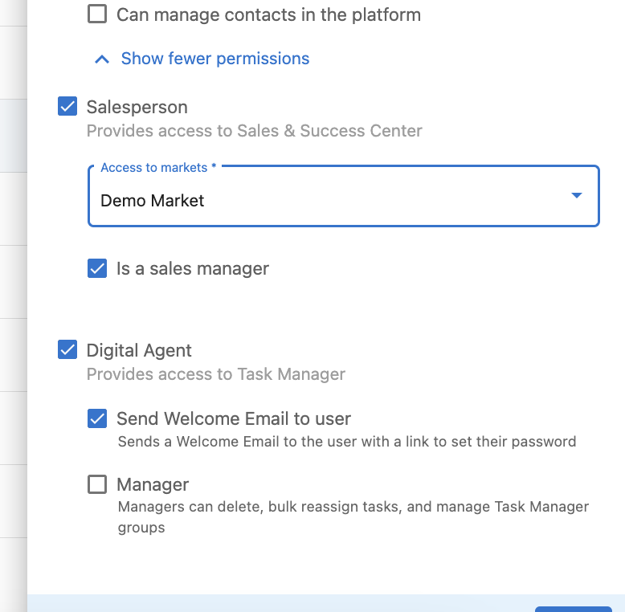

# Groups and their assignment to users
Below guide provides list of attributes, operation and request format for Update Group operations supported by Vendasta.

## Groups in Vendasta
Vendasta Groups are broadly classified into two categories, the first one is related to business users and the second one is related to platform users.

### List of Business Groups
Here is the list of available groups you can assign to a business user.

Here `{AG-ID}` is the `account group id` or `business location id`
| id                          | display name                   | type            |description     |
| --------------------------- | ------------------------------ | --------------- |--------------- |
| ba:access:{AG-ID}           | {AG-ID}                        | business        | Access to the business location |
| ba:getStarted:{AG-ID}       | Get Started for {AG-ID}        | businessFeature | Access to Get Started within the business location |
| ba:dashboard:{AG-ID}        | Dashboard for {AG-ID}          | businessFeature | Access to Dashboard within the business location |
| ba:inbox:{AG-ID}            | Inbox for {AG-ID}              | businessFeature | Access to Inbox within the business location |
| ba:messageInInbox:{AG-ID}   | Messaging in Inbox for {AG-ID} | businessFeature | Access to Messaging in Inbox within the business location |
| ba:myMeetings:{AG-ID}       | My Meetings for {AG-ID}        | businessFeature | Access to My Meetings within the business location |
| ba:store:{AG-ID}            | Store for {AG-ID}              | businessFeature | Access to Store within the business location |
| ba:customerList:{AG-ID}     | Customer List for {AG-ID}      | businessFeature | Access to Customer List within the business location |
| ba:executiveReport:{AG-ID}  | Executive Report for {AG-ID}   | businessFeature | Access to Executive Report within the business location |
| ba:guides:{AG-ID}           | Guides for {AG-ID}             | businessFeature | Access to Guides within the business location |
| ba:files:{AG-ID}            | Files for {AG-ID}              | businessFeature | Access to Files within the business location |
| ba:businessProfile:{AG-ID}  | Business Profile for {AG-ID}   | businessFeature | Access to Business Profile within the business location |
| ba:socialConnection:{AG-ID} | Social Connections for {AG-ID} | businessFeature | Access to Social Connections within the business location |
| ba:orders:{AG-ID}           | Orders for {AG-ID}             | businessFeature | Access to Orders within the business location |
| ba:invoices:{AG-ID}         | Invoices for {AG-ID}           | businessFeature | Access to Invoices within the business location |
| ba:myProducts:{AG-ID}       | My Products for {AG-ID}        | businessFeature | Access to My Products within the business location |

For example if `{AG-ID}` is `AG-MXX5P286VP` then the table will look similar to this below

| id                          | display name                  | 
| --------------------------- | ----------------------------- | 
| ba:access:AG-MXX5P286VP     | AG-MXX5P286VP                 | 
| ba:getStarted:AG-MXX5P286VP | Get Started for AG-MXX5P286VP | 
| ba:dashboard:AG-MXX5P286VP  | Dashboard for AG-MXX5P286VP   |

The same groups are shown in below image on how it reflects in Vendasta

To see this permission in partner centre go to **[partners.vendasta.com](https://partners.vendasta.com)** > **Businesses** > **Users** > Click **Kebab Menu**(3 vertical dot) on an user > **Edit Permissions**



### List of Platform Groups
Here is the list of available groups you can assign to a partner user.
                     
| id                         | display name                      | type            |
| -------------------------- | --------------------------------- | --------------- |
| pc:access                  | Platform Admin                    | platformFeature |
| pc:canCustomizeWhitelabel  | Can customize platform            | platformFeature |
| pc:canAccessBilling        | Can manage company billing        | platformFeature |
| pc:canManageSales          | Can Manage Sales                  | platformFeature |
| pc:canManageAccounts       | Can Manage Accounts and Users     | platformFeature |
| pc:canManageTasks          | Can Manage Task Manager           | platformFeature |
| pc:canAccessBrands         | Can Manage Brand                  | platformFeature |
| pc:canAccessMarketing      | Can manage marketing              | platformFeature |
| pc:canAccessDashboard      | Access to Dashboard               | platformFeature |
| pc:canAccessOrders         | Can Manage Orders                 | platformFeature |
| pc:canManageAdmins         | Can create and manage admins      | platformFeature |
| pc:canAccessMarketplace    | Can Access Marketplace            | platformFeature |
| pc:canEnableApps           | Can Enable Products               | platformFeature |
| pc:canAccessCompanyProfile | Can view and edit company profile | platformFeature |
| pc:canAccessAutomations    | Can View and Edit Automations     | platformFeature |
| pc:canManageRetailBilling  | Can manage retail billing         | platformFeature |
| ssc:access                 | Can access Sales & Success Center | platformFeature |
| ssc:manage                 | Is sales manager                  | platformFeature |
| tm:access                  | Can access Task Manager           | platformFeature |
| tm:manage                  | Can manage Task Manager           | platformFeature |

The same groups are shown in below image on how it reflects in Vendasta

To see this permission in partner centre go to **[partners.vendasta.com](https://partners.vendasta.com)** > **Administration** > **My Team** > Click **Kebab Menu**(3 vertical dot) on an user > **Edit Member**




## Assigning a user to a group 
### Provide user access to a business location
For example we want to provide access to the business location `AG-MXX5P286VP` to an user. Now the id of the group is `ba:access:AG-MXX5P286VP`

**Request**
`PATCH /Groups/ba%3Aaccess%3AAG-MXX5P286VP HTTP/1.1`
```json
{
    "schemas": ["urn:ietf:params:scim:api:messages:2.0:PatchOp"],
    "Operations": [{
        "op": "Add",
        "path": "members",
        "value": [{
            "value": "U-e6d11318-2e15-e44c-bc82-77c6b7fc4fac"
        }]
    }]
}
```

### Provide user access to a platform features
For example we want to make the user `Platform Admin`, the group id for this is `pc:access`

**Request**
`PATCH /Groups/pc%3Aaccess HTTP/1.1`
```json
{
    "schemas": ["urn:ietf:params:scim:api:messages:2.0:PatchOp"],
    "Operations": [{
        "op": "Add",
        "path": "members",
        "value": [{
            "value": "U-e6d11318-2e15-e44c-bc82-77c6b7fc4fac"
        }]
    }]
}
```

## Removing a user from a group 
For example we want to remove `Platform Admin` role from the user

**Request**
`PATCH /Groups/pc%3Aaccess HTTP/1.1`
```json
{
    "schemas": ["urn:ietf:params:scim:api:messages:2.0:PatchOp"],
    "Operations": [{
        "op": "Remove",
        "path": "members",
        "value": [{
            "value": "U-e6d11318-2e15-e44c-bc82-77c6b7fc4fac"
        }]
    }]
}
```


