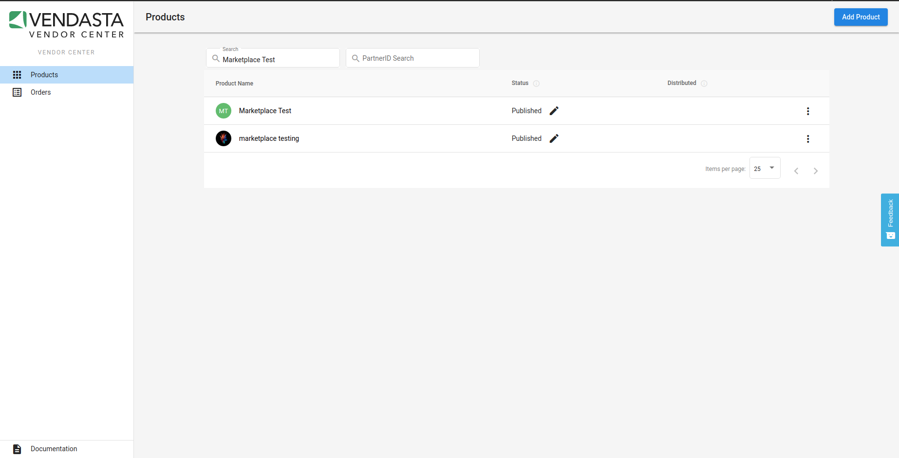
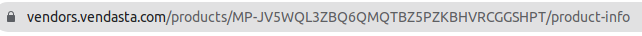
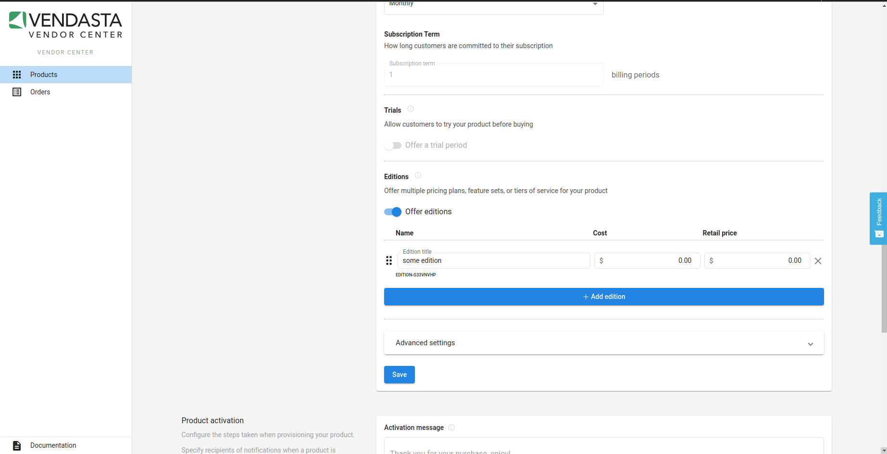
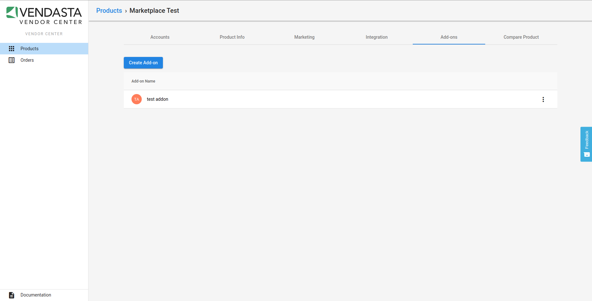

# Find a SKU

We currently only support creating orders for products that don't include order forms. An API to list the SKUs you are selling is in the `proposed` state. In the mean time please use this list or reach out to support@vendasta.com if you can't find a product you are looking for.

Variably priced products are also not currently able to be activated over API.

>Not all skus will map to elgible service provider ids for SSO. Please coordinate with your vendasta integration representative for service provider ids. 

**The SKU is typically different between the demo and production environments so be sure to use the correct values.**

## Vendasta Products

### Business App Pro
Reccomended to be activated together.

You may also copy the recommended package in Partner Center, and then provide the package id of your newly created package as a line item for the [Create Order](https://developers.vendasta.com/platform/7c53df73cfa65-create-order) API.

Product | Production SKU | Demo SKU
--------|----------------|---------
Inbox Pro — AI-assisted web chat lead capture | MP-DKT6XHPM6NCCDNK2TPDPVD3PG3V7ZHWP| N/A
Campaigns Pro | MP-ZGJ6V4QRP77WPMDKXS6VDRNX58Q42P7P | MP-WF5KS7FHTGV4LR5DBQ4D6XKCCDB5B6G7
Local SEO Pro | MS:EDITION-CFH5CKHC | MS:EDITION-MXWLTQPN
Reputation Management Premium | RM:EDITION-JFRPLQPN | RM:EDITION-BFXF8W8Q
Social Marketing Pro | SM | SM

### Reputation Management

Product | Production SKU | Demo SKU
--------|----------------|---------
 Standard |RM:EDITION-F7JZ5TV8 | RM:EDITION-38SMW45H
 Pro | RM | RM
 Premium | RM:EDITION-JFRPLQPN | RM:EDITION-BFXF8W8Q

The base Reputation Management product must be already active or included in the same order as any of the addons.

Addon | Production SKU | Demo SKU
--------|----------------|---------
Review Display Widget Pro | A-5QGW8G8VVG | A-PRLDSG2NCG
Premium Apartment Source | A-6XN73QJSG4 | A-RVQCK24434
Premium Hospitality Sources | A-KNPFMLMVQP | N/A
Rapid Reviews | A-DVDGNKC4Q3 | A-DJNQ55XZ6T
Canada - SMS 100 | A-L7WB6P65R3 | N/A
Canada - SMS 1000 | A-24PD56BDKG | N/A
Canada - SMS 200 | A-5RHV56LBRT | N/A
Canada - SMS 50 | A-XRJS6LJ42B | N/A
Canada - SMS 500 | A-4SS6QXMHQC | N/A
United Kingdom - SMS 100 | A-7KFCRJ2LFF | N/A
United Kingdom - SMS 1000 | A-N4TP83DXFP | N/A
United Kingdom - SMS 200 | A-STZQJN7FVK | N/A
United Kingdom - SMS 50 | A-QWVQNFPQFH | N/A
United Kingdom - SMS 500 | A-DFTK3DKXR6 | N/A
United States - SMS 100 | A-7336232MVS | N/A
United States - SMS 1000 | A-G7J2PJZZSS | N/A
United States - SMS 200 | A-NBZXMTZR3D | N/A
United States - SMS 50 | A-FL4L4THJZV | N/A
United States - SMS 500 | A-4GTDC7X8V2 | N/A

### Social Marketing

Product | Production SKU | Demo SKU
--------|----------------|---------
 Standard |SM:EDITION-FVGBNLVZ | SM:EDITION-SWVF3WH8
 Pro | SM | SM

### Local SEO

Product | Production SKU | Demo SKU
--------|----------------|---------
 Local SEO Standard | MS | MS
 Local SEO Pro | MS:EDITION-CFH5CKHC | MS:EDITION-MXWLTQPN

The base Local SEO product must be already active or included in the same order as any of the addons.

Addon | Production SKU | Demo SKU
--------|----------------|---------
Additional Keywords | A-K7DDJR48BQ | A-V5BVRPHMVM
Listing Distribution | A-GMXXNQ4ZGD | N/A
Listing Distribution \| Monthly | A-SX5MP2FB2L | N/A
Listing Sync Pro \| Australia Yearly | A-XQL2HMD6VV | N/A
Listing Sync Pro \| Australia Monthly | A-P3XFBZ6HCC | N/A
Listing Sync Pro \| Canada Yearly | A-2BRLL3FH4K | N/A
Listing Sync Pro \| Canada Monthly | A-C8GSD6X4D2 | N/A
Listing Sync Pro \| Canada Basic Yearly | A-TD5HVH6LHM | N/A
Listing Sync Pro \| Canada Basic Monthly | A-Z6S5D3QGHF | N/A
Listing Sync Pro \| France Yearly | A-C6CNBPXPCC | N/A
Listing Sync Pro \| France Monthly | A-VM8PJZ8PZ5 | N/A
Listing Sync Pro \| Germany Yearly | A-W2GGC7TJW3 | N/A
Listing Sync Pro \| Germany Monthly | A-JZGCTTMHLG | N/A
Listing Sync Pro \| Italy Yearly | A-KK3MNLFDP5 | N/A
Listing Sync Pro \| Italy Monthly | A-CDFBK8XW2W | N/A
Listing Sync Pro \| United States \| Yearly | A-TMPJGS28X7 | N/A
Listing Sync Pro \| United States \| Monthly | A-ZR7M2V6TCD | N/A
Listing Sync Pro \| United States \| Yext \| Yearly | A-WNW446NCNS | N/A
Listing Sync Pro \| United States \| Yext \| Monthly | A-8PHKXVRZFS | N/A
Listing Sync Pro \| United Kingdom \| Yearly | A-WCH8K4S8LS | N/A
Listing Sync Pro \| United Kingdom \| Monthly | A-FR72RDNMP6 | N/A

 ### Website

Product | Production SKU | Demo SKU
--------|----------------|---------
 Standard |MP-ee4ea04e553a4b1780caf7aad7be07cd:EDITION-VFNL43ZF | MP-9cc9f21f0a234a46ad78087fc09f16bc:EDITION-RC58KN73
 Pro | MP-ee4ea04e553a4b1780caf7aad7be07cd | MP-9cc9f21f0a234a46ad78087fc09f16bc

### Customer Voice

Product | Production SKU | Demo SKU
--------|----------------|---------
 Standard |MP-c4974d390a044c28aec31e421aa662b2:EDITION-TC8HJZNS | MP-fba21121b71148c9bb33e11fcd92d520:EDITION-4WWZC3RJ
 Pro | MP-c4974d390a044c28aec31e421aa662b2 | MP-fba21121b71148c9bb33e11fcd92d520

### Advertising Intelligence

Product | Production SKU | Demo SKU
--------|----------------|---------
 Standard |MP-94072e44d5364872b672d7ab4fc7a7e8 | MP-94072e44d5364872b672d7ab4fc7a7e8

Addon | Production SKU | Demo SKU
--------|----------------|---------
Advanced Reporting | A-3QKQHBS3R6 | A-K73WLF2QL6

 ## Third Party Marketplace Products

The parent product must be already active, or be included in the same order as any of its addons.

Third party products are not activatable on the Demo environment.

Note that Products with Order Forms are not able to be activated via API at this time, and thus are not included in this list. Please Contact support@vendasta.com if there is a Product that you are looking to activate that is not on this list.
 
Product | Addon | Production SKU
--------|-------|---------
Boomerangme | | MP-BQCMZ777FPZJSQWFTQLXNL737NJJHZ44
CaptiveDiner - Restaurant Menu Software | | MP-VNDLKKZCSN7R6WQB48ZX4H5F3T8ZCT2R
Chat Essential Unlocked | | MP-RZJMLS6HQWCJ2RPQS8HCCKCFGKBM7H4F
| | Chat Essential Customization Services | A-N7PNWBRJL4
Codex B2B LinkedIn Prospecting Tool & Sales Automation Platform (**Personal, or A.I seat Add-ons required)**| | MP-6S5KSCTK2F4W8SVHSN3QPNMLDM7TFN3L 
|  | Done-For-You (Campaign Creation, Monitoring & Fulfillment) | A-M4PM52CCGT
|  | Campaign Creation (One-Time Setup) | A-L54FFGN4CN
|  | LinkedIn & Email Automation Personal Seat | A-G6LGVVGQHB
|  | 5 X A.I LinkedIn & Email Automation Seats | A-FSKPGM4PV4
Contact Button | | MP-NFNBZ6N4XSRLGVB8RXTDSPVZCSWQJNXR
DashThis \| Individual - 3 | | MP-2GSBGNRVZ2FLTFXKLS8Q8MXVRTSLPQQH:EDITION-2P3VD7L4
DashThis \| Profesisonal - 10 | | MP-2GSBGNRVZ2FLTFXKLS8Q8MXVRTSLPQQH:EDITION-QFW22XJS
DashThis \| Business - 25 | | MP-2GSBGNRVZ2FLTFXKLS8Q8MXVRTSLPQQH:EDITION-GHBLXZ77
DashThis \| Standard - 50 | | MP-2GSBGNRVZ2FLTFXKLS8Q8MXVRTSLPQQH:EDITION-L7H27ZQN
DashThis \| Enterprise - 100 | | MP-2GSBGNRVZ2FLTFXKLS8Q8MXVRTSLPQQH:EDITION-PRLSFPFZ
DashThis \| Enterprise - 125 | | MP-2GSBGNRVZ2FLTFXKLS8Q8MXVRTSLPQQH:EDITION-FMHDRNP3
DashThis \| Enterprise - 150 | | MP-2GSBGNRVZ2FLTFXKLS8Q8MXVRTSLPQQH:EDITION-KWW5CPHZ
DashThis \| Enterprise - 175 | | MP-2GSBGNRVZ2FLTFXKLS8Q8MXVRTSLPQQH:EDITION-CJMV7M2F
DashThis \| Enterprise - 200 | | MP-2GSBGNRVZ2FLTFXKLS8Q8MXVRTSLPQQH:EDITION-PVS6636R
DashThis \| Enterprise - 225 | | MP-2GSBGNRVZ2FLTFXKLS8Q8MXVRTSLPQQH:EDITION-THRB8KVL
DashThis \| Enterprise - 250 | | MP-2GSBGNRVZ2FLTFXKLS8Q8MXVRTSLPQQH:EDITION-2S7NT6TR
DashThis \| Enterprise - 500 | | MP-2GSBGNRVZ2FLTFXKLS8Q8MXVRTSLPQQH:EDITION-RDLGPT35
Data-Dynamix Email Marketing |  | MP-2da7414a9f604f518d6ae0127080f9e2
geo.Ad from Chalk Digital |  | MP-MLXNLFH72ZZKHTLDKQ784PCZPJPTPV63
|  | ChalkCredits- One Time | MP-MLXNLFH72ZZKHTLDKQ784PCZPJPTPV63
|  | ChalkCredits - Monthly | MP-MLXNLFH72ZZKHTLDKQ784PCZPJPTPV63
|  | ChalkCredits - Monthly (Higher spend) | MP-MLXNLFH72ZZKHTLDKQ784PCZPJPTPV63
Hike SEO | | MP-NTQXLQ2V3VRHKRJ3C2JGFT78TRDRQFPW
MobiFirst \| 100 End users/Unlimited sites | |MP-6P8SJKS7XS4BRMB6H46LXB2SLQNNKFBT:EDITION-V7HWFG2G
MobiFirst \| 500 End users/Unlimited sites | |MP-6P8SJKS7XS4BRMB6H46LXB2SLQNNKFBT:EDITION-V7HWFG2G
MobiFirst \| Unlimited End users/Unlimited sites | |MP-6P8SJKS7XS4BRMB6H46LXB2SLQNNKFBT:EDITION-V7HWFG2G
Mobile Marketing & Communications Platform \| Business Texting Dashboard |  | MP-W74STW72G4WVKL52LT45NFJC3XH7M5J2
Mobile Marketing & Communications Platform \| PLUS |  | MP-W74STW72G4WVKL52LT45NFJC3XH7M5J2:EDITION-H3HV6RMH
Mobile Marketing & Communications Platform \| ADVANCED |  | MP-W74STW72G4WVKL52LT45NFJC3XH7M5J2:EDITION-VK8BNJ84
Mobile Marketing & Communications Platform \| PRO |  | MP-W74STW72G4WVKL52LT45NFJC3XH7M5J2:EDITION-4GP72F25
|  | 1,000 Message Credits | A-TXBH4JDMRD
|  | 10,000 Message Credits | A-5ZTN8JGJTN
|  | 2,500 Message Credits | A-DQNTF4XT4R
|  | 25,000 Message Credits | A-XWMRP7LXPL
|  | 5,000 Message Credits | A-CQFNHBHHL4
|  | Digital Kiosk Stand (incl. shipping costs) | A-BGNMVFWGLH
Metricool |  | MP-3QXRWPFX4BTVGZ3NBPSWPS8L3S7QS66W
POWr Website Plugins |  | MP-RC8VV8K5DV368F6WJ3ZCSKWG2Q62QSDC
Powtoon | | MP-ZBQDBVV5H26SGFMZHFMQPHQDHG7XH6RF
Privacy & Security Premier Tool (By Control.My.Id) | | MP-FPGBQW85BG86XRRVPBWMPW63HXBRC254
Social Status \| Starter |  | MP-NFWJLTZ2CN55VMRNMHQ46PNSG66M287J:EDITION-WHNMFHKG
Social Status \| Pro |  | MP-NFWJLTZ2CN55VMRNMHQ46PNSG66M287J:EDITION-64QW5D6W
Social Status \| Business |  | MP-NFWJLTZ2CN55VMRNMHQ46PNSG66M287J:EDITION-HDJBV62Q
Social Status \| Company |  | MP-NFWJLTZ2CN55VMRNMHQ46PNSG66M287J:EDITION-HRVWMC5H
Social Status \| Enterprise |  | MP-NFWJLTZ2CN55VMRNMHQ46PNSG66M287J:EDITION-4FSP4PQK
|  | Report Credits | A-6FH4KGDFM4
The 'Near Me' Suite by Uberall | | MP-6TZ5WKDL8ZR5GBHX7QPQ7DTRSQDQBCN7
Top4 - Local Pages & Locator | | MP-WT4HRDH3PVWSZWB3LD3M2SJRGKW86WH3
Top4 - Local Pages & Locator (Yearly) | | MP-GTTKCZWFPXDBN38XGDGCZCKSD8JJGM2Q
Visual Visitor - WebID +Person Identification |  | MP-VR5QZ5WVXBVK3H5J6FLG8NCPWKTNRXJG

## Your Private Products

Product SKUs start with `MP-`. Example: `MP-c4974d390a044c28aec31e421aa662b2`

Addon SKUs start with `A-`. Example: `A-GMXXNQ4ZGD`

Edition SKUs match the format `^MP-.*:EDITION-.*$`. Example `MP-c4974d390a044c28aec31e421aa662b2:EDITION-1234`

### Edition SKU (appId:editionId)
Navigate to [https://vendors.vendasta.com/products](https://vendors.vendasta.com/products) and login to view the products table.

Find the product you wish to build the purchase CTA for.

Clicking on the product will bring you to the product details page.

From there, the (appId) is located in the url. It starts with `MP-`:

If your product does not support editions the entire editionSKU is the `MP-` prefixed id.

If your app does use editions your editionSKU will have two parts joined by a colon:
 - `MP-` prefixed appId.
 - `EDITION-` prefixed editionId.
 
The editionId is just below the name (prefixed with `EDITION-`).

### Addon SKU (addonId)
To obtain the addonId click the `Add-ons` tab and find the addon.

Clicking on the addon will bring you to the addon details page.
The url will contain the addon SKU (addonId) prefixed with `A-`.

