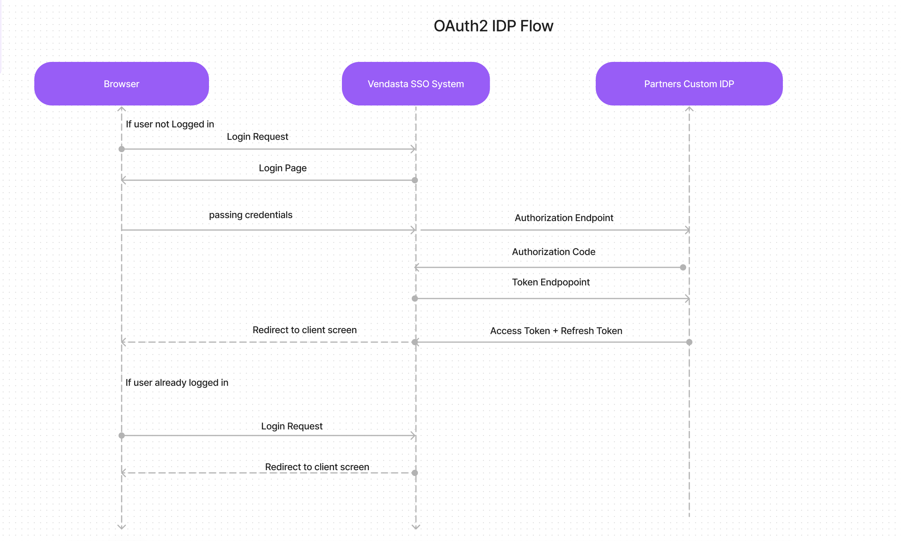

# Implementing-OAUTH2-IDP

To implement the Oauth2, you need to create and configure the three endpoints.

You need to create the Oauth2 client, where you are setting the client id and client secret. 

The client id is stored in Vendasta's Database, which will be used for doing authorization.

When a user tries to access one of Vendasta's centers or a marketplace app in a web browser Vendasta’s SSO system will check to see if the user is already logged into Vendasta. 

If the user is not logged in we will redirect the user’s web browser to the OAuth2 Authorization Endpoint.

Authorization, token, and user info are three endpoints, you can see the details below 

You can see the flow diagram where you get to know end-to-end flow. 

**Authorization Endpoint**

An authorization URL where the resource owner grants authorization to the OAuth client to access the protected resource.

This endpoint compares the client ID that you pass to the client ID that is stored in Vendasta's database. If it is matching then the user will get authorized and you will get an authorization code along with some JSON data, you will see these details below.

Request Params :

parameter | Description  
---------|----------|
|client_id    |Oauth client to have the client id and client secret, you have to give the client id.
|response_type |Tells the authorization server which grant to execute.
|redirect_uri  |A successful response from this endpoint results in a redirect to this URL.
|scope |list of permissions that the application requires.
|state |An opaque value, used for security purposes.

eg.

    https://sso-api-prod.apigateway.co/oauth2/authorize?
    client_id=31300CDFGHRT &   
    redirect_uri=https://sso-api-prod.apigateway.co/oauth2/callback &
    response_type=code & 
    scope=openid,email &     
    state=f9376d0d-badd-48b4-bf8a-872978aa0098

Response Params :

parameter | Description  
---------|----------|
|code    | Authorization Code which is generated by the server, you need to use this code for the token endpoint.
|state  |The exact value that was provided in the request

**Token Endpoint**

A token request URL where the OAuth client exchanges an authorization grant/authorization code to generate an access token.

Request Params :

parameter | Description  
---------|----------|
|client_id | The ID of the application. 
|client_secret | password or secret code of the application.
|grant_type   |grant type should be authorization_code. 
|code | Value from the Authorization endpoint’s response.
|redirect_uri  |A successful response from this endpoint results in a redirect to this URL.

eg.

    https://sso-api-prod.apigateway.co/oauth2/token?
      client_id=client &
      client_secret=secret &
      grant_type=authorization_code &   
      redirect_uri=https://sso-api-prod.apigateway.co/oauth2/callback &
      code=shddswjdj97-dbdbRRF &
      redirect_uri={redirect_uri}

Response Params :

parameter | Description  
---------|----------|
|access_token | JWT token which gives you access to an application.
|token_type | It Will always be `bearer` for Vendasta but could technically be other types.
|refresh_token   | refresh token is used to generate a new access token.
|expires_in |it is in seconds.

**UserInfo Endpoint :**

You will use the access token to call the User Info endpoint.

Once you have configured the above endpoints on your server, you need to connect them to Vendasta.

[click here](https://partners.vendasta.com/integrations/sso
) to go **Partner SSO Integration**, and add your client_id, client_secret, and info about
 these three endpoints.

